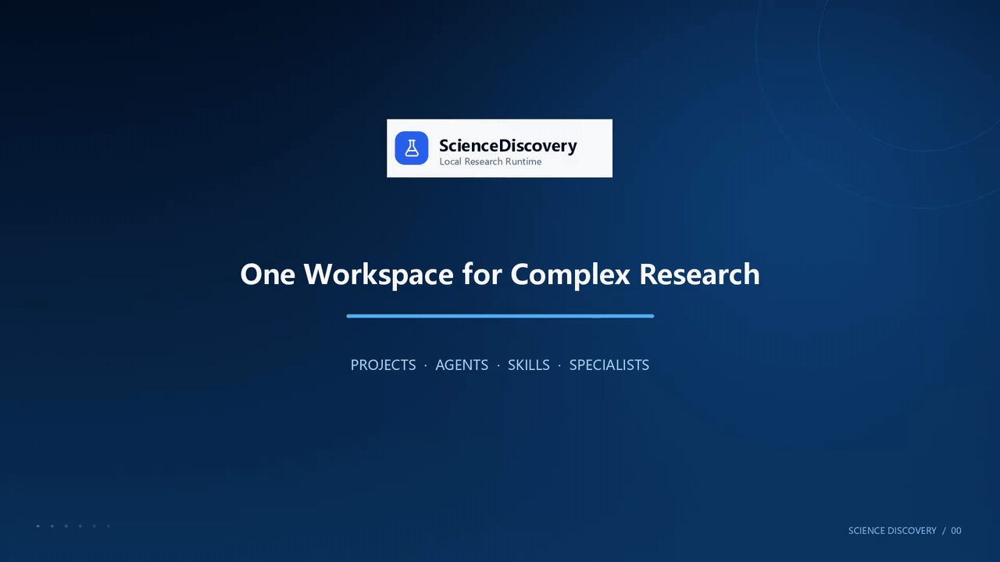

<div align="center">

# ScienceDiscovery

**The one-stop AI research workspace, built for scientists.**

Literature review, hypothesis, code, experiments and tuning — in one environment, with every step on the record.

[](LICENSE)
[](https://github.com/openJiuwen-ai/sciencediscovery/releases/tag/0.2.0)
[](#requirements)
[](docs/README.md)

[Download](#installation) · [Quick start](docs/en/tutorial/01-quick-start.md) · [Documentation](docs/README.md) · [Contributing](CONTRIBUTING.md) · [中文](README_zh.md)



</div>

## Overview

ScienceDiscovery is a locally run research workspace: an agent reads the literature, writes and runs code inside a sandbox, and records the origin of every result. Everything executes on your own machine, against your own files, with your own model keys.

## Installation

Download the build for your architecture from [release 0.2.0](https://github.com/openJiuwen-ai/sciencediscovery/releases/tag/0.2.0):

```bash
curl -LO https://github.com/openJiuwen-ai/sciencediscovery/releases/download/0.2.0/ScienceDiscovery-0.2.0-linux-x86_64
chmod +x ScienceDiscovery-0.2.0-linux-x86_64
./ScienceDiscovery-0.2.0-linux-x86_64 serve
```

Open the **`Open to sign in`** URL that `serve` prints. The browser stores the local service access token automatically, so there is nothing to copy. That token is distinct from a model API key, and the URL grants access to this machine's workspace — keep it private. The web interface is served at <http://127.0.0.1:4310>; the terminal window only runs the service.

For arm64, use [`ScienceDiscovery-0.2.0-linux-aarch64`](https://github.com/openJiuwen-ai/sciencediscovery/releases/download/0.2.0/ScienceDiscovery-0.2.0-linux-aarch64). Bubblewrap is the only host dependency. Source mode (Linux and macOS) and Docker are covered in the [deployment guide](docs/en/how-to/deployment.md); source mode is also how you run the agent loop on [JiuwenSwarm](docs/en/how-to/run-with-jiuwenswarm.md), this project's agent backend.

## Configure a model

ScienceDiscovery does not bundle a model; you connect your own API. Open **System configuration** at the bottom of the left sidebar and complete two sections:

1. **Model registry** — select a preset provider or enter a **Base URL** manually, provide the **API key**, then add the model you intend to use.
2. **Global defaults** — set the model added in the previous step as the **task model**.

Field definitions, and which of them an environment variable can set instead, are in the [configuration reference](docs/en/reference/configuration.md).

## First task

Create a Project and a Session, drop a CSV or a PDF into the workspace, and describe the analysis you want. A permission card appears before the first code execution; once approved, tool calls and artifacts are shown in the timeline. For a step-by-step walkthrough, see the [Quick Start tutorial](docs/en/tutorial/01-quick-start.md).

## Capabilities

| Capability | Description | Reference |
|---|---|---|
| **Literature and data access** | Built-in connectors reach paper and data repositories; PDFs are parsed into citable evidence | [Literature research case](docs/en/how-to/literature-research-case-guide.md) · [Custom MCP servers](docs/en/how-to/configure-custom-mcp.md) |
| **Sandboxed code execution** | The agent writes, debugs and runs Python, R and shell inside a fail-closed sandbox | [Sandbox execution](docs/en/explanation/sandbox-execution.md) |
| **Task decomposition** | Planning and multi-agent orchestration distribute a task across sub-agents and a cross-domain skill library | [Subagent orchestration](docs/en/explanation/subagent-orchestration.md) · [Skills](docs/en/explanation/skill-progressive-disclosure.md) |
| **End-to-end provenance** | Code, environment, logs and cited evidence are recorded per deliverable; the optional memory graph makes the chain navigable | [Review and provenance](docs/en/explanation/review-provenance.md) · [ScienceMemory](docs/en/how-to/science-memory-setup.md) |

## Command line

A running `serve` can also be driven from the terminal:

```bash
./ScienceDiscovery run "Summarize these results" > answer.md
cat prompt.txt | ./ScienceDiscovery run --stdin --auto-approve | jq .
```

`run` connects to the same control plane as the browser and reads the access token from the data directory, so sharing a `--data-dir` with `serve` requires no further configuration. Run directly in a terminal, it writes the answer to stdout and progress to stderr; in a pipe it emits JSONL, and a non-interactive run must pass `--auto-approve`, since it cannot answer permission prompts. For the full option list, run `./ScienceDiscovery run --help`.

## Requirements

| Path | Host requirements |
|---|---|
| **Prepackaged binary** | Linux x86_64/aarch64, Bubblewrap |
| **Local source mode** | Linux x86_64/aarch64 or macOS x64/arm64; Node.js 22.19+, pnpm 11.1.2, Python 3, uv 0.9+, Git; Bubblewrap on Linux, built-in Seatbelt on macOS |
| **Docker** | Linux x86_64/aarch64, Docker Engine 24+, Compose v2, unprivileged user namespaces |

Managed scientific environments run on a pinned micromamba, so no system Python, R or conda is required.

## Architecture

A browser UI talks to an adapter that puts the agent loop on [JiuwenSwarm](https://gitcode.com/openJiuwen/jiuwenswarm): the adapter sits on the public port and reverse-proxies the Node control API behind it, JiuwenSwarm runs the model loop and calls back into the API for every tool, and workspace tools, sandbox execution, scientific connectors, PDF extraction, permissions, provenance and review checks stay enforced by the Node control plane. See [Run agent turns on JiuwenSwarm](docs/en/how-to/run-with-jiuwenswarm.md) for the install step, the environment variables and the full topology diagram.

> [!WARNING]
> ScienceDiscovery is not a multi-user production service. The adapter and the API listen on loopback by default; access uses one bearer token and there is no TLS termination. Exposing either interface elsewhere must be an explicit deployment choice on a trusted, secured network. Python, R, and shell commands run in a fail-closed platform sandbox (Bubblewrap on Linux and Seatbelt in macOS source mode); the control API, the adapter, JiuwenSwarm, the PDF worker, and outbound model/provider calls run outside that sandbox as trusted control-plane operations.

## Documentation

| Section | Guides |
|---|---|
| **Tutorial** | [Quick start](docs/en/tutorial/01-quick-start.md) |
| **How-to** | [Deployment](docs/en/how-to/deployment.md) · [Run on JiuwenSwarm](docs/en/how-to/run-with-jiuwenswarm.md) · [Custom MCP](docs/en/how-to/configure-custom-mcp.md) · [Network proxy](docs/en/how-to/configure-network-proxy.md) · [ScienceMemory](docs/en/how-to/science-memory-setup.md) |
| **Reference** | [Configuration](docs/en/reference/configuration.md) · [REST API](docs/en/reference/rest-api.md) · [Built-in tools](docs/en/reference/builtin-tools.md) · [Runtime behavior](docs/en/reference/runtime-behavior.md) |
| **Explanation** | [Architecture](docs/en/explanation/architecture.md) and the [full index](docs/en/explanation/README.md) |

The complete English and Chinese indexes are in [docs/README.md](docs/README.md); development setup and test commands are in [CONTRIBUTING.md](CONTRIBUTING.md).

## License

[Apache License 2.0](LICENSE).

This product serves solely as a workflow orchestration tool and does not embed any AI model capabilities. When users integrate AI models for specific business scenarios, they shall bear full responsibility for compliance obligations under the EU AI Act and other relevant regulatory frameworks.
