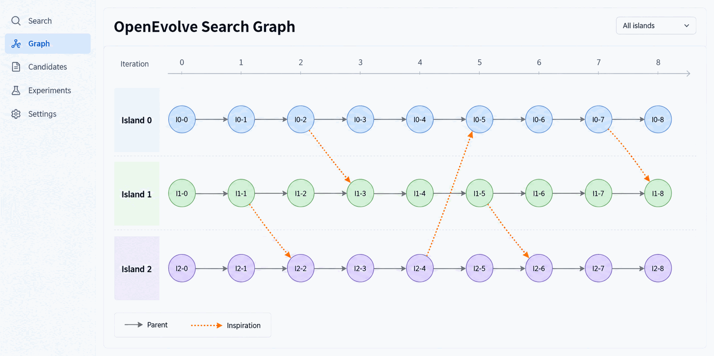
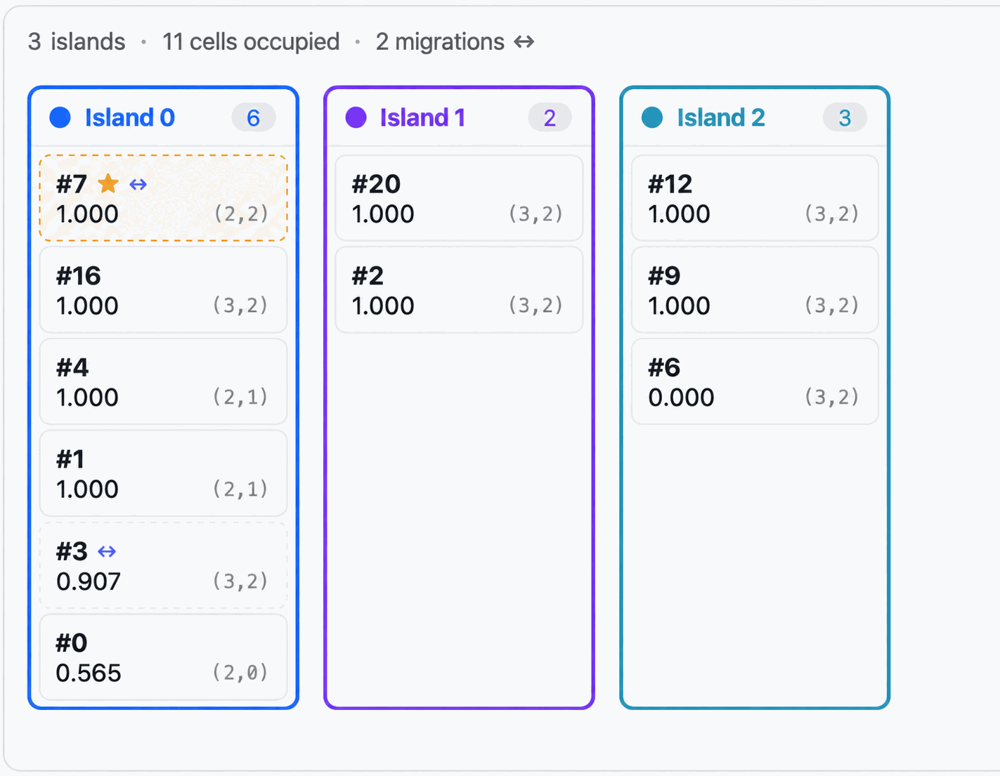
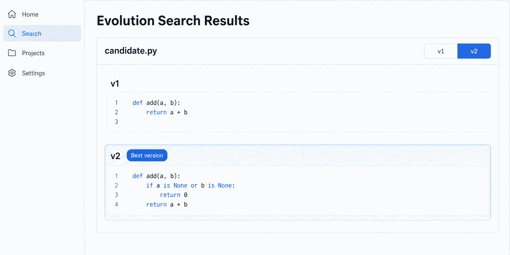
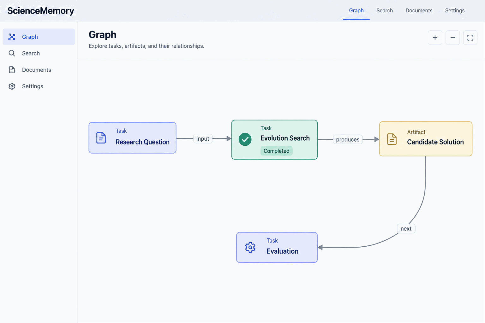

# Program evolution (`/evolve-design`)

`/evolve-design` improves something by repeated search rather than by one edit. You describe what
"better" means as a number; the product writes dozens of variants, scores each one, keeps what
scores higher, and hands back the best version alongside the one it started from.

> This page explains what a search is, when it works, and why it is built this way. For a first search you can complete end to end,
> see [Use PUCT to optimize a text compression algorithm](../domains/evolve-a-solution.md). Engine internals
> and standalone deployment of the sidecar are in
> [the evolution sidecar note](../developer-docs/evolve-standalone.md).

## What a search actually is

A candidate is anything text-shaped: a function, a whole program, a prompt, a report section, a
configuration file, an experimental protocol. One iteration picks a parent, asks the model to
rewrite it, runs the result against your scoring, and files the score. Repeat within a budget.

Everything therefore rests on one property: **the scoring has to separate a good candidate from a
bad one.** Scoring that cannot does not raise an error — it produces a flat run, twenty
expansions that all land on the same number, and a budget spent for no signal. Most of the design
below exists to catch that before it costs you a run.

You start one by saying what you want in the conversation — "write a compress/decompress pair,
lossless, highest ratio wins". The `evolve-design` skill turns that into a search proposal
through four checkpoints, and the server executes it.

## Four ways to score

The scoring mode is the seam that lets one search engine serve very different goals. All four are
available to both engines.

| Mode | The number comes from | Suits |
|---|---|---|
| `dataset_metric` | A metric computed over labelled rows | Prediction, fitting, anything with a table and a column to get right |
| `test_gate` | The pass rate of a test suite | Code whose correctness is defined by tests rather than by a number |
| `custom_script` | A scorer the drafting model writes | Deterministic goals with no table and no suite — "split these addresses into four fields, as accurately as possible" |
| `llm_judge` | A judge model reading against a frozen rubric | Prose, prompts, protocols, plans — anything with nothing to execute and nothing to measure |

`llm_judge` is what makes `/evolve-design` work on things that are not programs over tables. It is also
the only non-deterministic mode, which is why the rubric is frozen and why its runs need more
units per measurement than the others.

## Two engines

Both engines share the same Domain seam — the starting point, the way a candidate is scored, the
prompt that rewrites one, and the name of the number being reported — and swap only the algorithm
core.

**PUCT** (`puct`) keeps a tree. Every candidate is a node with a parent, the tree is append-only,
and selection uses `rank + c_puct · P · √visits_total / (1 + visits)`. It suits continuous
refinement of one starting point.

**OpenEvolve** (`openevolve`) keeps a multi-island MAP-Elites archive: `islands × feature_bins²`
cells binned by code complexity and code diversity, one occupant per cell, and every
`migration_interval` generations each island's best is copied to the next island around a ring.
Parents are picked ε-greedily (70% best, 30% random), and the mutation prompt also carries an
*inspiration* program chosen for being maximally different from the parent. It suits wide search
spaces where a tree converges too early.

The choice is offered when the search is proposed; if you do not choose, the run is PUCT.

## Why the reported number is trustworthy

### The data is split three ways

| Shard | Who sees it | What it decides |
|---|---|---|
| `rollout` | The search | The search's own trajectory |
| `gate` | The search | Every candidate's rank — the number the tree selects on |
| `test` | Nobody, until the end | The number reported to you |

Nothing that steers the search ever touches the `test` shard, so the figure you are shown at the
end cannot have been inflated by the search process itself. This is also why the `gate` shard
should be the largest of the three: it is the only number the search actually steers by, and a
gate too small means the tree ranks on noise silently, for the whole run.

### A probe runs before the search does

Before spending the budget, the server runs four sandboxed evaluations to check that the scoring
can actually discriminate: whether it separates a working program from a deliberately corrupted
one, whether the starting point still has headroom, whether repeated evaluation is stable, and
whether a failure diagnostic carries enough location information to be repairable. A scoring
scheme that fails the probe is rejected with the reason, before it costs you a run.

### The scorer is frozen

A candidate may not edit the thing measuring it. The rule is enforced in two layers — a proposal
filter over frozen paths, stated in the mutation prompt, and enforcement below it — because, as
the upstream engine puts it: *without it the shortest path to a high score is to weaken the thing
measuring it.*

## Watching one run

The score chart plots one point per candidate with a step line tracking the best so far, a dashed
baseline for the starting point, and the held-out `test` figure once the run ends. Candidates that
failed to run are marked rather than hidden. The stream on the right lists every version with its
parent, its change summary, and its score.

For OpenEvolve runs two further views open up. The graph lays candidates out along the iteration
axis with one horizontal band per island and dashed edges to the inspiration program, so a jump in
the search is explainable:

The grid is the archive itself — one column per island, the global best marked ★, migrated
candidates marked ↔, and each cell's complexity/diversity coordinates:

## What you get back

The starting point and the winner are saved as two versions of the same artifact, so the result
is a diff rather than a loose file, and a further search can be started from either version.

The run is also mirrored into [ScienceMemory](../developer-docs/science-memory.md) when that is enabled: the search
node links to its starting point through an `input` edge and to its result through `produces`, and
the node detail carries the baseline and held-out numbers.

## Where it runs

The search executes in a separate sidecar process (`services/evolve`), and every candidate is
evaluated inside the same bubblewrap sandbox as any other code the product runs. Model calls from
the sidecar use a run-scoped ephemeral token, so provider credentials never leave the control
plane. The sidecar's only client is the Node control API.

A candidate that fails to run gets a limited number of automatic repair attempts, carrying its own
error back into the prompt; a repaired candidate is adopted only if its score strictly improves.

## What a search costs, and when not to run one

Each expansion is one model call plus one sandboxed evaluation of every unit in the shards the
search can see. Budgets are therefore stated in expansions, and the useful range depends on how
far the search has to travel: 4–6 for a known defect, 12–20 for swapping an approach, 20+ for
writing something from scratch.

A search is the wrong tool when you already know the edit to make — that is one edit, not fifty —
and when no number can separate better from worse. A criterion like "well-structured and readable"
is true of any document and will produce a flat run.

Finally, a run that comes back with nothing above the starting point **is a result**: on this
scoring, these variations do not beat the seed. What is legitimately yours to reconsider then is
the scoring — whether the cases reward what you actually care about — rather than the approach you
would have liked the candidates to take.

## Related

- [Use PUCT to optimize a text compression algorithm](../domains/evolve-a-solution.md) — a first run, end to end.
- [ScienceMemory](../developer-docs/science-memory.md) — where a finished search is recorded.
- [Sandbox execution](../developer-docs/sandbox-execution.md) — how candidates are isolated while they are scored.
