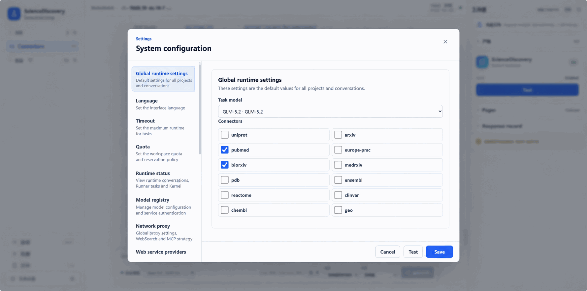

# Scientific MCP and Skills: connect resources and reuse research methods

Research needs concrete evidence: a protein annotation, a paper's experimental conditions, or atom positions in a structure file. Model knowledge alone cannot reliably keep that information current and inspectable. Without suitable procedures, even good data can lead to results that are difficult to reproduce.

ScienceDiscovery connects scientific data and tools through MCP and supplies reusable methods through Skills. Connectors obtain actual records; Skills guide retrieval, organization, computation, and delivery, so each investigation need not start from scratch.

A useful shorthand separates the three extension concepts: **MCP is a tool, Skill is a method, and Specialist is a role.** MCP answers what the Agent can call, Skill answers how a kind of work should be done, and Specialist packages responsibility, Skills, and available tools into a role the main Agent can invoke.

## Scientific resources already connected

The product provides these built-in scientific connectors. Enable them for the task without writing your own adapter.

| Research need | Included sources | Starting points |
| --- | --- | --- |
| Papers and preprints | PubMed, Europe PMC, arXiv, bioRxiv, medRxiv | Discover studies, retain identifiers and links, and obtain supported records or download entry points |
| Protein function and structure | UniProt, PDB | Query annotations, structure entries, and available structure files |
| Genes and variants | Ensembl, ClinVar | Look up genes, transcripts, variants, and associated annotations |
| Pathways and experimental data | Reactome, GEO | Find pathway information and public expression-study records |
| Compounds and activity | ChEMBL | Query compounds, targets, and activity records |

An LLM Wiki connector also supports knowledge-page search and reading when configured and available. Included integration does not guarantee service availability, unrestricted downloads, or full-text access. Check the current session's actual tools and connection status.

## Research methods already prepared

The product bundles 17 Skills, covering complete workflows and composable steps:

| Work area | Bundled Skills | Purpose |
| --- | --- | --- |
| Research organization and evidence briefs | `science-research-team`, `life-science-evidence-brief` | Organize literature/data research and produce source-grounded summaries |
| Retrieval, extraction, and writing | `literature-searcher`, `evidence-extractor`, `report-writer` | Move from source discovery to evidence and report synthesis |
| Computation and assessment | `code-engineer`, `result-evaluator` | Produce reproducible analysis and assess methods and results |
| Citation and numerical checks | `citation-reviewer`, `computation-reviewer` | Examine source support and agreement between numeric claims and evidence |
| Material-design exploration | `creative-material-design`, `assessment-screening`, `insight-aggregator` | Propose candidates, assess perspectives, and summarize feedback |
| Autonomous research and artifact improvement | `idea-tree-team`, `evolve-design` | Prepare Idea Tree inputs and explain results; design and launch evolution searches |
| Structures and antibody workflows | `structure-pocket-inspection`, `antibody-design` | Inspect local PDB structures and pockets; organize antibody-design computation |
| Reusable methods | `skill-creator` | Draft reviewable skill packages from explicit requests |

Each method has prerequisites. Structure inspection needs files; antibody workflows need the relevant software and hardware; reviewer skills need evidence to inspect. Installation does not prove that a model read or executed a Skill, and actual outputs still need checking.

## Bring your laboratory's resources into the workflow

Connect a private database, an existing MCP service, or a specialized computing interface. Package recurring SOPs, analysis scripts, and delivery standards as Skills. Tools and methods can evolve separately: changing a data interface need not rewrite the whole procedure, and improving a procedure need not add a service.

User extension paths include local STDIO and remote HTTP/SSE MCP servers, plus skill imports from files, folders, ZIPs, and Git. An Agent can draft a Skill for human confirmation. Manage credentials in settings rather than public skill instructions.

The advanced guides provide the actual setup steps:

- [Connect custom MCP servers](../advanced-setup/configure-custom-mcp.md): services, authentication, connection tests, and tool selection.
- [Import and manage Skills](../advanced-setup/configure-skills.md): packages, import, availability, and verification.
- [Create Specialists](../advanced-setup/configure-specialists.md): organize resources and responsibilities into research roles.
