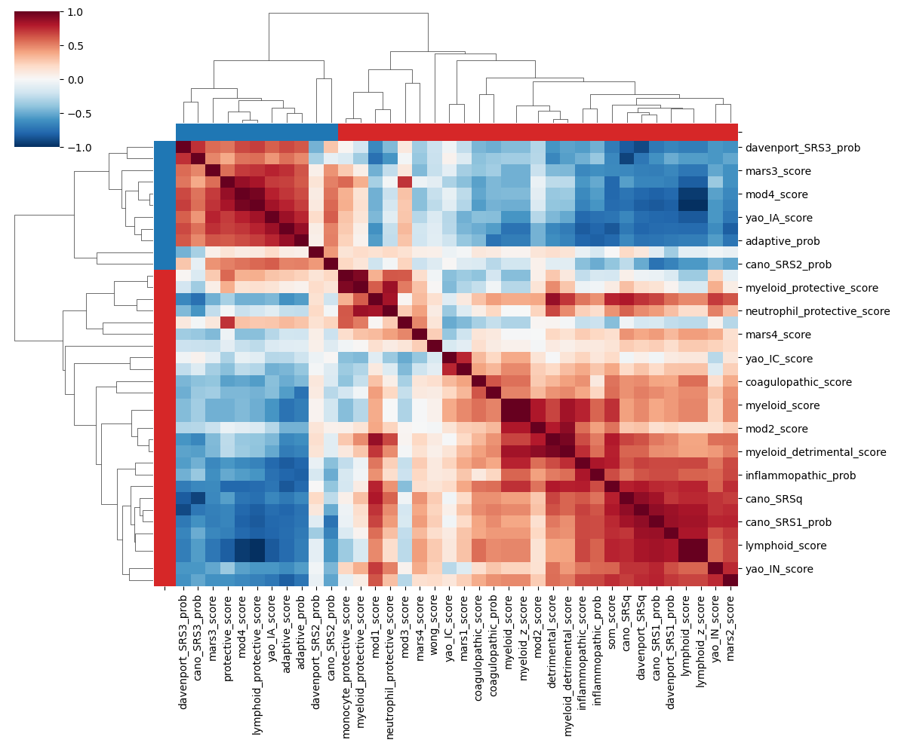
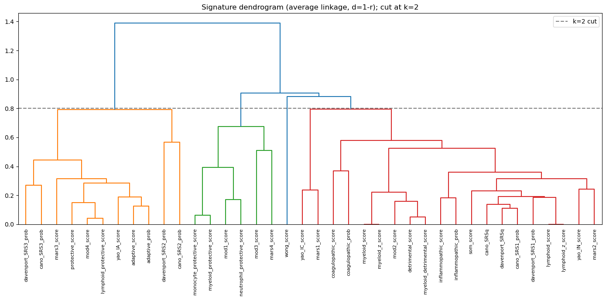

# Analyze immune features with Agent Team

This walkthrough uses the supplied “Sepsis immune subtyping consensus analysis” case (BiomniBench-DA, DA-14-1) to show how Agent Team analyzes data, reviews results, and produces a report.

The case describes 38 immune feature scores from approximately 3,948 patients. The goal is to identify scores that vary together across patients and group features with similar patterns. The objects being clustered are **features**, not patients.

The case instructions and original data are available through the Hugging Face links below. Download the required files, then follow this guide to start the analysis. The two case figures illustrate how to read the results. See [Agent Team](../core/agent-team.md) for the feature overview.

## 1. Prepare the data and environment

Complete the [quick start](../getting-started/quick-start.md). Make sure the conversation can use `science-research-team`, the built-in analysis, review, and reporting specialists are enabled, and code execution is available.

Get the case instructions and required files from Hugging Face:

- [Read the case question and task requirements](https://huggingface.co/datasets/phylobio/BiomniBench-DA/blob/main/da-14-1/instruction.md).
- [Download the case data files](https://huggingface.co/datasets/phylobio/BiomniBench-DA/tree/main/da-14-1/environment/data): open the directory and download the files required by the instructions.

Upload the score table and explain:

- What each row represents, such as one patient or one sample.
- Which columns contain immune scores and which contain identifiers, cohort labels, or other information.
- How missing values are represented and whether a patient may have multiple rows.

The example calls the input `scores.csv`. Replace it with your actual filename and supply a score-column list or data dictionary. Do not analyze patient identifiers or numeric cohort codes as feature scores.

## 2. Request the analysis

```text
Use science-research-team to analyze my uploaded scores.csv.
Each row represents one patient. The accompanying data dictionary identifies
the score columns.

Calculate pairwise correlations between immune feature scores and perform
hierarchical clustering of features to identify groups that vary together.
Use only the uploaded data; do not search the literature.

First check sample count, score columns, missing values, and constant columns.
Explain preprocessing, the correlation measure, the conversion to distance,
and the clustering method. Evaluate a reasonable number of groups rather
than forcing a two-group result.

Have code-engineer perform the analysis, result-evaluator review it,
and report-writer prepare the deliverables.
Produce an English report.md, a process record trace.md, analysis code,
correlation_matrix.csv, cluster_assignments.csv,
correlation_heatmap.png, and dendrogram.png.
State which results passed review and what limitations remain.
```

These filenames are deliverables specified for this task; you can change them. A data-only task mainly uses three roles and does not need a literature research stage.

## 3. Follow analysis and review

The team inspects the data and runs the analysis, then the review agent checks the results. Requested revisions return to the analysis stage. The skill defaults to at most three analysis-and-review rounds.

Follow execution through the conversation's task and tool records. Supply field definitions or clarification about unusual data when requested. The report should record the actual sample and feature counts, missing-value handling, and method choices.

Review should focus on whether:

- Correlations were calculated across patients and clustering was applied to features.
- Missing-value handling changed effective sample sizes and constant columns were handled.
- The distance definition fits the clustering method and the group count is justified.
- The main groups remain stable under another correlation measure or sample resampling.

A silhouette score can help assess how well groups separate. The adjusted Rand index (ARI) can compare group assignments across analyses. The report must identify the comparisons and calculation methods; checks that were not performed should be marked unverified.

## 4. Read the figures and tables

### Correlation heatmap

Each cell shows the correlation between two features. In this example, red means positive correlation and blue means negative correlation; deeper colors indicate stronger relationships. Blocks along the diagonal help reveal features that vary together.



### Hierarchical clustering dendrogram

The dendrogram shows how features are progressively merged. Lower merges indicate greater similarity under the chosen distance. This example's title records average linkage and `d = 1 - r`; your own report should record these choices too.



Both figures come from the supplied case and illustrate the output format. Use the current run's cluster assignment table and documented method to establish group count and membership, rather than branch colors or an illustrative cut line alone.

### Report and process record

Compare the figures with `cluster_assignments.csv` to see which features belong to each group. The report should distinguish relationships supported by the data from further biological interpretation. Correlation alone does not establish causation or support clinical decisions.

The `trace.md` record should identify inputs, executed code, review findings, and how those findings were addressed. Analysis code and environment instructions support rerunning the work; figures or a statement that review passed are not sufficient on their own.

## 5. Check the delivery

Confirm that the requested files exist, figures open, table entries match the features actually analyzed, and the report states the review outcome.

If issues remain at the iteration limit, the team should deliver the latest results and mark the analysis incomplete. Use the stated limitations to supply additional data or revise the task before continuing.

For another dataset, keep the sequence “define the question → inspect data → analyze → review → report,” and replace the fields, methods, and deliverables.
