# ScienceDiscovery User Guide: Literature Research Case

This guide follows a cross-database literature research task to demonstrate the full workflow:
starting the service, configuring the system, dispatching a task, granting approvals, and
reviewing results.

## 1. Case overview

This cross-database literature research case compares gene expression in adult versus pediatric
liver parenchymal cells, with a focus on immune-related pathways. It searches PubMed for papers
published in 2023–2025 and bioRxiv for recent preprints available in its rolling search window, then
generates a bar chart of gene counts for the top 14 enriched pathways and flags contradictory
findings across studies.

A task like this normally takes researchers days of manual reading and data extraction, with low
efficiency and a high risk of omissions. ScienceDiscovery orchestrates multiple intelligent tools
to automate the workflow end to end:

- **Retrieval**: the literature-search MCP tool builds a search strategy and queries both databases in parallel.
- **Understanding and analysis**: a large model understands the literature, and a code tool performs pathway enrichment analysis and plotting.
- **Traceability**: the full execution is structured in ScienceMemory as a graph, forming a
  traceable task chain.
- **Report writing**: when writing the final report, the Agent queries the graph's recorded
  execution chain so that each statement is associated with supporting evidence, avoiding
  unsupported results.

---

## 2. Model configuration

Go to **System configuration → Model registry** and add a model:

| Field | What to enter |
|---|---|
| Display name | `task-gpt5` (user-defined) |
| Base URL | `https://api.openai.com/v1` |
| Model ID | `gpt-5` |
| API token | The model's key. Encrypted at rest; the UI hides the plaintext |

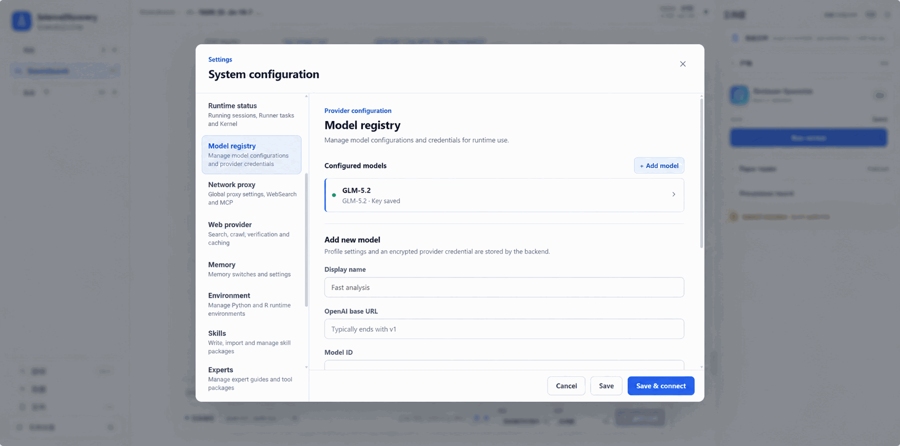

---

## 3. System settings

### 3.1 Connectors

Connectors are the Agent's entry points to external research databases. If a connector is not enabled, the Agent has no corresponding tool.

For this case, enable the following two under **System configuration → Connectors** (or the connector panel in session settings):

- **PubMed**: covers published biomedical literature.
- **bioRxiv**: covers preprints from the same period.

Other connectors (arXiv, UniProt, Reactome, etc.) can stay off.


### 3.2 Timeouts (optional)

Timeouts constrain the Agent's maximum wait or run time across five scenarios—model no response, single turn, Runner sandbox, permission wait, and kernel idle—to keep one stalled point from dragging down the whole session.

Under **System configuration → Timeouts** you can configure these five items:

| Field | What it controls |
|---|---|
| Agent no response | Stop this turn automatically when the model produces no streaming output or progress within the time |
| Agent single turn | Total time limit for one full round (model reasoning + tool calls + streaming output) |
| Runner execution | Wall-clock limit for a single sandbox code execution |
| Permission wait | Maximum time the Agent waits for the user to approve a permission card |
| Kernel idle | Survival time of a persistent Python/R kernel with no activity |

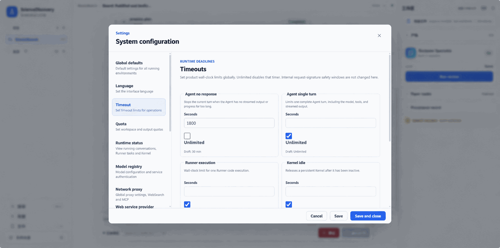

### 3.3 Quotas (optional)

Quotas constrain the resource caps the Agent may occupy in the sandbox and upload paths, covering single-file size, single-request size, workspace total capacity, and single-execution output, to keep large files or large outputs from dragging down the session.

Under **System configuration → Quotas** or the corresponding environment variables, you can configure these four items:

| Field | What it controls |
|---|---|
| Upload per file | Maximum size of a single uploaded file |
| Upload per request | Total body-size limit for a single multipart upload request |
| Workspace total | Total file capacity accumulated in the Runner workspace |
| Execution output | Retention limit for stdout + stderr of a single execution; truncated automatically when exceeded |

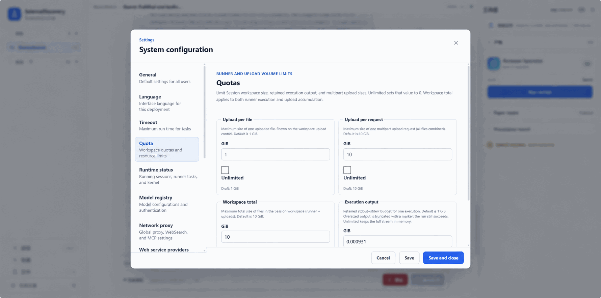

### 3.4 Prepare the Python/R environment

This module hosts the Python and R runtimes the Agent uses through `run_shell` inside the sandbox (`python -m`, Python files, or `Rscript`). After the Runner starts, it pulls the managed micromamba in the background and prepares a read-only base; users can create named environments from the base and install packages as needed. Later updates happen in place without cloning; each change records a Revision for traceability. The Agent selects an environment ID, and execution uses its latest state.

Go to **System configuration → Environments**. On first start the Runner downloads and verifies micromamba in the background, with status changing from `provisioning` to `ready`; this takes a few minutes. On failure the page shows the reason and offers a retry.
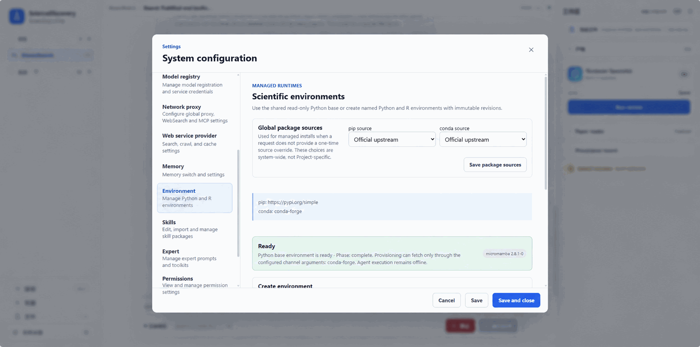

### 3.5 Skills (optional)

The Skill module hosts the skill packages the Agent can call during a run.

To create a skill, use any of the following under **System configuration → Skills**:

| Method | Operation |
|---|---|
| Manual | Add a skill-package directory directly in the manager and fill in `SKILL.md` and the required fields (`name` must be lowercase-hyphenated and match the directory name; `description` must be non-empty) |
| Agent-created | Explicitly describe the Skill in chat. The Agent loads `skill-creator` and submits a complete inactive draft with `create_skill`; review files and the previous-revision diff in Settings > Skills, then confirm it. Selected mode must explicitly enable the confirmed Skill |
| Natural-language draft | Describe the workflow in natural language; the manager generates a reviewable draft that is then landed as a skill package |
| Distill from the current session | Distill a skill draft from the session history and add it to the skill library after review |
| Local import | Import a local skill folder, `SKILL.md` file, or ZIP package; folder selection preserves relative paths and packages them before import, while ZIPs are checked for path traversal, symlinks, encryption, duplicates, and size/file-count limits |
| Git repository import | Import from an HTTPS or SSH repository URL (a ref or subdirectory may be specified); credentials are read only from the local credential helper or SSH config and never appear in the repository URL or model context |

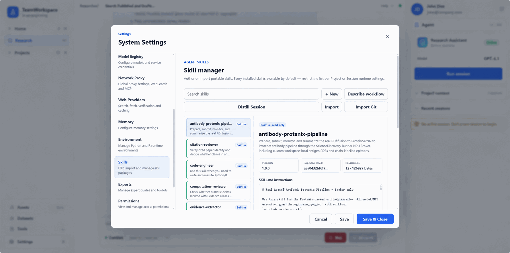

### 3.6 Specialists (optional)

The Specialist module packages a fixed set of instructions, model, skills, and connectors into a reusable Agent configuration.

To create a specialist under **System configuration → Specialists**:

1. Open **System configuration → Specialists** and click **New specialist**.
2. Fill in the basic information: a display name and a task description that describes the Agent's role and applicable scenarios.
3. Bind the resources the run needs: a task model, an optional skill whitelist, an optional connector whitelist, an optional environment, and a review model.
4. After saving, the specialist appears in the "Specialist" dropdown on the Session creation page and can be selected by name when creating or running a session.


This case does not need a custom specialist; the system built-in default is sufficient.

### 3.7 ScienceMemory (optional)

ScienceMemory is optional. It stores a session's execution and argumentation as a graph: research
goals, task steps, code, output files, and every cited claim in the final report with its evidence
source are persisted as nodes and edges. This makes the path from a conclusion to its recorded
evidence clickable and traceable.

Enable and use it as follows:

1. Open **System configuration → Memory** and turn on **Enable ScienceMemory**.
2. The default **Local files** backend needs no extra service. Choose **Neo4j server** only when a
   Neo4j-backed graph is required, then enter its HTTP address, username, and password.
3. Once enabled, execution events such as literature retrieval and code runs are automatically
   mirrored into the graph as a task chain. The Agent records the citation chain that connects
   report claims to their evidence and source literature.
4. In the report, click a citation tag to open the corresponding evidence or artifact and follow
   its graph relationships.

For Neo4j setup, storage choices, and connection status, see
[Set up ScienceMemory](../advanced-setup/science-memory-setup.md).

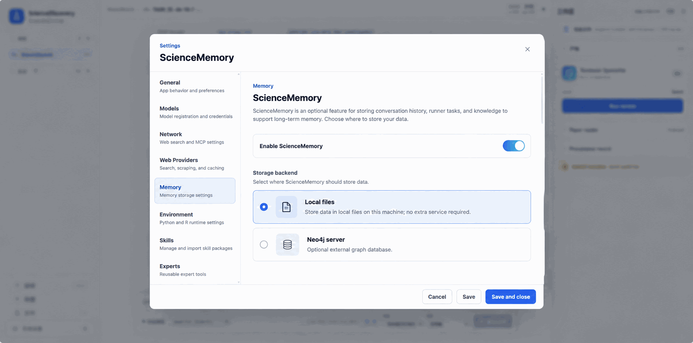

---

## 4. Create a Project and Session

On the left, **New Project**:

- Name: `adult-pediatric-liver-immunity`
- Description: one sentence stating the goal

New Session: open the Project → **Add session**.

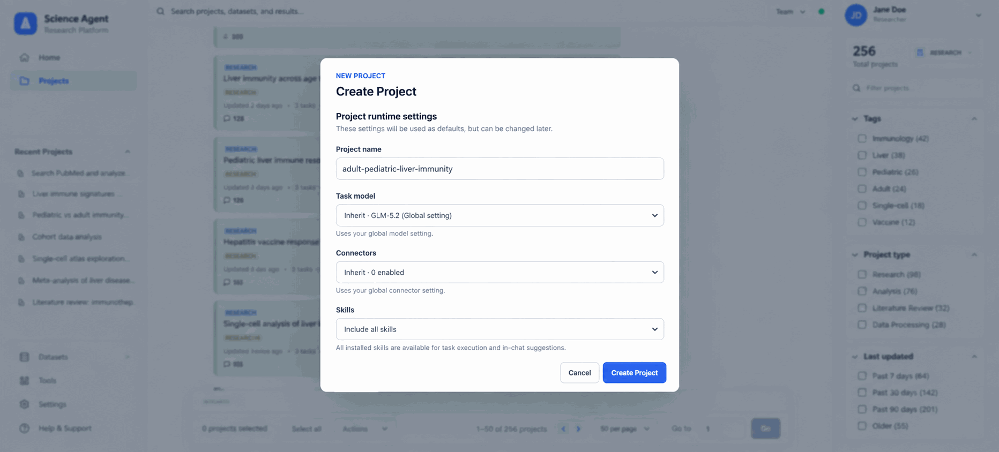

---

## 5. Dispatch the task

Enter the following task description in the dialog:

```text
Search PubMed for papers published 2023-2025 and bioRxiv for recent preprints in its available
search window. Compare gene
expression in adult vs pediatric liver parenchymal cells. Focus on immune-related
pathways. Generate a pathway enrichment bar chart showing gene count comparison
between the two populations for the top 14 enriched pathways. Flag any
contradictory findings across studies. In the report, state the number of records returned by each
source and the publication years represented in the bioRxiv results.
```

Click **Run analysis**.
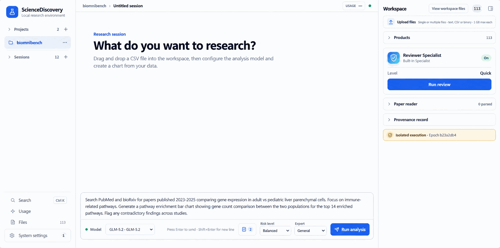

---

## 6. Approvals and permissions

While a task runs, the Agent pauses before high-risk operations and pops a permission card, waiting for the user to approve. The table below lists the common approval types and what they mean:

| Approval type | Meaning |
|---|---|
| code | The Agent calls `run_shell` to execute code in the sandbox |
| connector | The Agent calls an MCP tool (e.g. `mcp__pubmed__search`, `mcp__biorxiv__search`) to access an external research database |
| download | The Agent calls `artifact_download` to download candidate files into the workspace |
| extraction | The Agent calls `paper_extract_pdf` to extract text and tables from a downloaded PDF |
| scientific-environments | The Agent calls `environment_install` and other managed-environment change tools |
| web | The Agent calls `web_search` or `web_fetch` to make a public-network request |

The card offers **Allow once**, **Allow same type**, and **Deny**. **Allow same type** creates a
revocable grant for matching requests with the same action and normalized resource category in the
current Session. Review or revoke it under **System configuration → Permissions**.

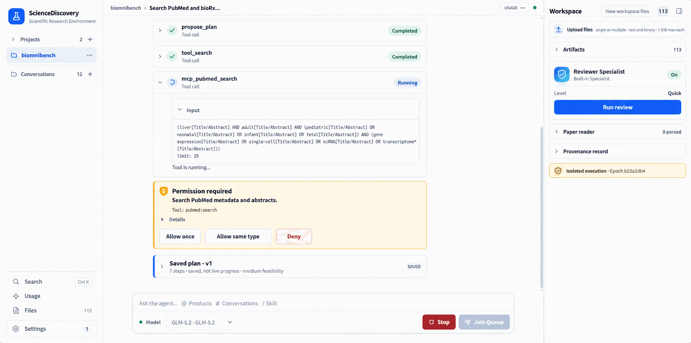

---

## 7. Review the results

The Agent outputs a report with clickable citation tags. Each tag leads to its cited content,
source literature, and execution chain, so the report's statements can be checked through their
recorded evidence. The graph makes the result traceable and reviewable, shortening literature
research that would normally take days to minutes while avoiding an opaque, unconstrained
report-generation path.

### 7.1 View artifacts

Open the artifact (Markdown report) in the right-hand artifact panel. The Evidence citations in the report body are clickable chips.
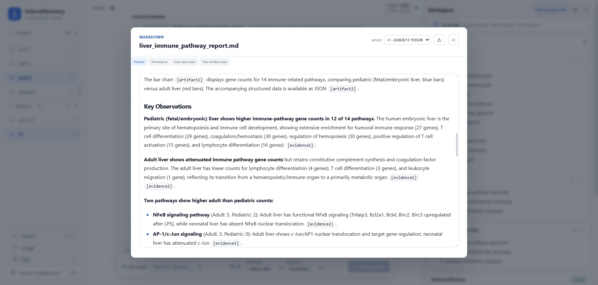

### 7.2 View Evidence

Click any Evidence chip to open the Evidence card. The card offers three entries:

| Entry | Use |
|---|---|
| **Preview** | View the content of the Evidence |
| **Provenance** | View the provenance of the Evidence, including the code, execution environment, and execution logs that generated it |
| **View this evidence in ScienceMemory** | View the ScienceMemory graph information related to this Evidence |

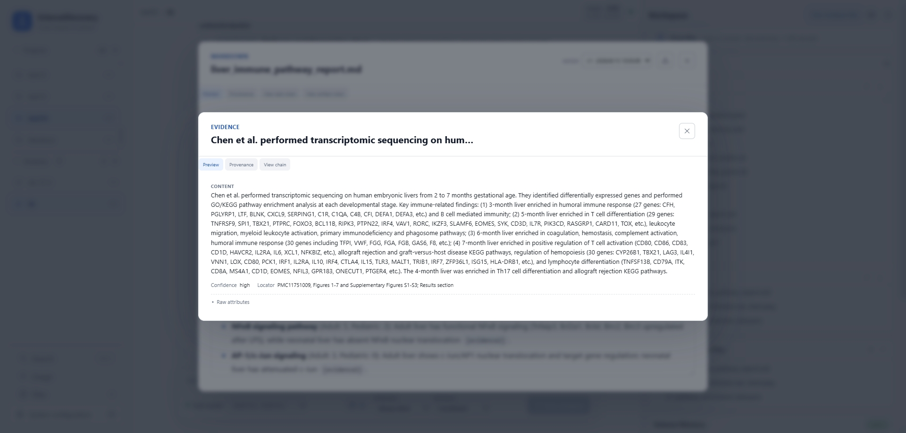
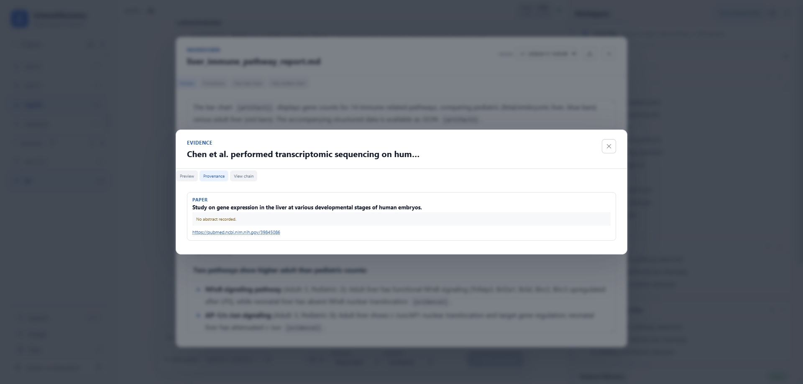

### 7.3 View the generation chain and citation chain

Click **View this evidence in ScienceMemory** to inspect the two chains of this Evidence:

- **Generation chain**: from the research goal, follow the task nodes to the code and execution records that generated the Evidence.
- **Citation chain**: from the Evidence up to its source literature, and to the Artifact / report claim that declared this Evidence.
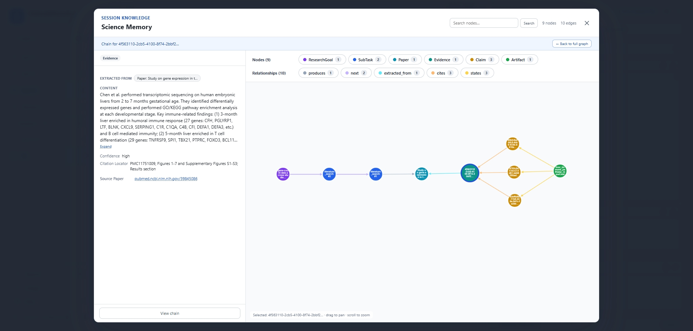
