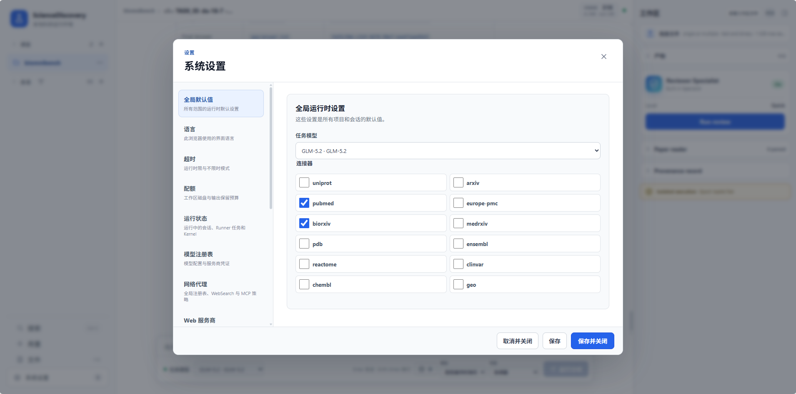

# 科研 MCP 与 Skill：接通科研资源，复用研究方法

科研任务需要具体依据：一个蛋白的注释、一篇论文的实验条件、一份结构文件中的原子位置。只靠模型已有知识，很难保证这些信息及时、准确且可以回查。同时，同样的数据若缺少合适的分析步骤，也容易得到不可复现的结论。

ScienceDiscovery 一方面通过 MCP 接入科研数据与工具，另一方面通过预置 Skill 提供可复用的方法。前者帮助 Agent 取得实际记录，后者指导它如何检索、整理、计算和交付，让每次研究不必从空白开始。

## 已经接入哪些科研资源

产品提供以下内置科研连接器，按研究需要启用即可，无需自行编写适配程序。

| 研究需求 | 预置来源 | 可以从哪里起步 |
| --- | --- | --- |
| 检索论文与预印本 | PubMed、Europe PMC、arXiv、bioRxiv、medRxiv | 查找相关研究，保留标识与来源链接，获取接口支持的记录或下载入口 |
| 蛋白功能与结构 | UniProt、PDB | 查询蛋白注释、结构条目及可用结构文件 |
| 基因与变异 | Ensembl、ClinVar | 查询基因、转录本、变异及相关注释 |
| 通路与实验数据 | Reactome、GEO | 检索通路信息和公共表达研究记录 |
| 化合物与活性 | ChEMBL | 查询化合物、靶点与活性记录 |

此外，LLM Wiki 连接器可在配置可用时提供知识页面的检索与读取。预置代表产品提供了接入能力，不代表外部服务永远在线、所有内容都能免费下载，或返回记录等于已读全文。实际工具范围与连接状态应以当前会话为准。

## 已经准备哪些研究方法

产品随附 17 个 Skill，既有完整工作流，也有可组合的小步骤：

| 工作方向 | 预置 Skill | 用途 |
| --- | --- | --- |
| 研究组织与证据简报 | `science-research-team`、`life-science-evidence-brief` | 组织文献与数据研究，形成可追溯的证据摘要 |
| 检索、阅读与成文 | `literature-searcher`、`evidence-extractor`、`report-writer` | 从来源发现到证据提取，再到报告综合 |
| 计算与结果评价 | `code-engineer`、`result-evaluator` | 编写可复现分析，检查方法和结果质量 |
| 引用与计算核查 | `citation-reviewer`、`computation-reviewer` | 检查引用支撑及数值与证据的一致性 |
| 材料方案探索 | `creative-material-design`、`assessment-screening`、`insight-aggregator` | 生成材料候选、分视角评价并整理反馈 |
| 自主研究与产物改进 | `idea-tree-team`、`evolve-design` | 准备 Idea Tree 输入与解读结果，设计并发起产物演进搜索 |
| 结构与抗体工作流 | `structure-pocket-inspection`、`antibody-design` | 检查本地 PDB 与口袋，组织抗体设计计算流程 |
| 方法沉淀 | `skill-creator` | 根据明确需求起草可审核的技能包 |

这些方法有各自前提。结构检查需要输入文件，抗体流程需要相应计算环境和硬件，Reviewer 技能需要待核查证据。安装了 Skill 不等于模型已经读取或执行它，模型遵循情况也需要通过实际产物检查。

## 让实验室自己的资源加入工作流

你可以接入自建数据库、已有 MCP 服务或专用计算接口，也可以把常用 SOP、分析脚本和交付规范整理成 Skill。工具与方法独立扩展：更换数据接口不必重写全部流程，改进方法也不要求新增服务。

这些入口面向用户开放。自定义 MCP 支持本地 STDIO 和远程 HTTP/SSE 服务；技能支持本地文件、目录、ZIP 与 Git 导入，也支持由 Agent 起草后人工确认。凭据在设置中管理，不应写入公开的技能说明。

具体接入步骤放在进阶指南中：

- [接入自定义 MCP](../advanced-setup/configure-custom-mcp.md)：添加服务、认证、测试连接和选择工具。
- [导入与管理 Skill](../advanced-setup/configure-skills.md)：准备技能包、导入、确认生效并验证。
- [创建 Specialist](../advanced-setup/configure-specialists.md)：把资源与职责组织成自己的研究角色。
