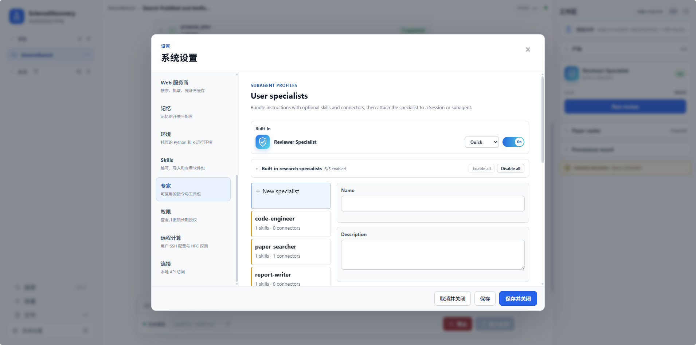

# 专业 Specialist：让科研任务各有专长

一份科研报告往往跨越几种工作：找文献、读证据、写代码、检查结果，再把发现组织成论述。它们需要不同的判断标准。检索时应尽量补齐来源，写报告时应克制新增未经核实的观点；负责实现分析的人，也需要有人从方法与可靠性的角度复核结果。

Specialist 将这些职责分开，并为每种角色准备指令、技能与工具范围。主 Agent 可以按任务需要调用合适的角色，把精力放在研究目标与综合判断上。对研究者而言，价值是减少重复交代工作要求，让分工和交付更清楚。

## 已经准备好的科研分工

ScienceDiscovery 预置了以下 8 个 Specialist。它们可以按需组合，不要求每次研究都启动完整团队。

| 预置角色 | 适合承担的工作 | 主要交付 |
| --- | --- | --- |
| `literature-searcher` 文献检索 | 查询可用学术来源、去重、记录覆盖缺口 | 来源清单与检索说明 |
| `evidence-extractor` 证据提取 | 从已提供的来源中提取发现、方法、统计量和局限 | 带来源定位的结构化证据 |
| `code-engineer` 代码分析 | 编写、执行和调试 Python/R 分析，记录方法与环境 | 脚本、计算结果和复现说明 |
| `result-evaluator` 结果评价 | 检查分析的准确性、完整性、稳健性与方法质量 | 是否需要修订及具体意见 |
| `report-writer` 报告撰写 | 综合已有研究摘要，保留矛盾与来源关系 | 按要求组织的最终报告 |
| `creative-material-design` 材料设计 | 围绕水处理材料提出结构、性质与可行性方案 | 候选材料设计 |
| `assessment-screener` 方案评估 | 按指定评估视角与评分细则审视材料候选 | 分维度评分、优缺点与验证说明 |
| `insight-aggregator` 洞察汇总 | 比较多个评估结果，呈现共识与分歧 | 可供下一步使用的改进洞察 |

前五种角色覆盖文献与数据研究的常见环节，后三种面向材料方案的设计和评估。材料相关角色仍是可调用的预置能力，不意味着当前 Idea Tree 会通过这些 Specialist 自动执行真实实验；[Idea Tree](idea-tree.md) 有自己的研究循环与运行边界。

例如，鸟类迁徙调研可以先由检索角色整理来源，再由证据角色保留鸟种、实验条件和结论边界，最后综合成报告。数据分析则更需要代码与结果评价角色配合。具体是否分派以及怎样组合，取决于任务与实际执行记录。

预置角色的职责是固定的，可启用或停用。角色名称不会带来专业资格，多个角色也可能共享模型偏差；清楚的分工帮助你检查过程，而不替代科研验证。`result-evaluator` 是研究流程中的结果评价角色，与面向产物的 [Reviewer 机制](science-memory-reviewer.md) 也不是同一个入口。

## 把你所在领域的经验接进来

预置角色不可能覆盖每个实验室的流程。你可以创建自己的 Specialist，把研究范围、判断规则、交付要求与可用连接器组织起来。例如，一位专门核查队列筛选的数据助手，可以要求逐步记录纳入排除人数，并交付可复现脚本。

自定义角色使用现有运行环境与权限体系，不需要为了增加一个角色重新部署整套系统。需要专用工具或方法时，可以先接入 MCP 或导入 Skill，再组合进适用的研究流程。

- [创建与使用自定义 Specialist](../advanced-setup/configure-specialists.md)：填写职责、配置资源并验证一次任务。
- [科研 MCP 与 Skill](mcp-skills.md)：查看已有工具与方法，以及扩展入口。
- [文献调研教程](../domains/literature-research.md)：从问题到可核查报告。
