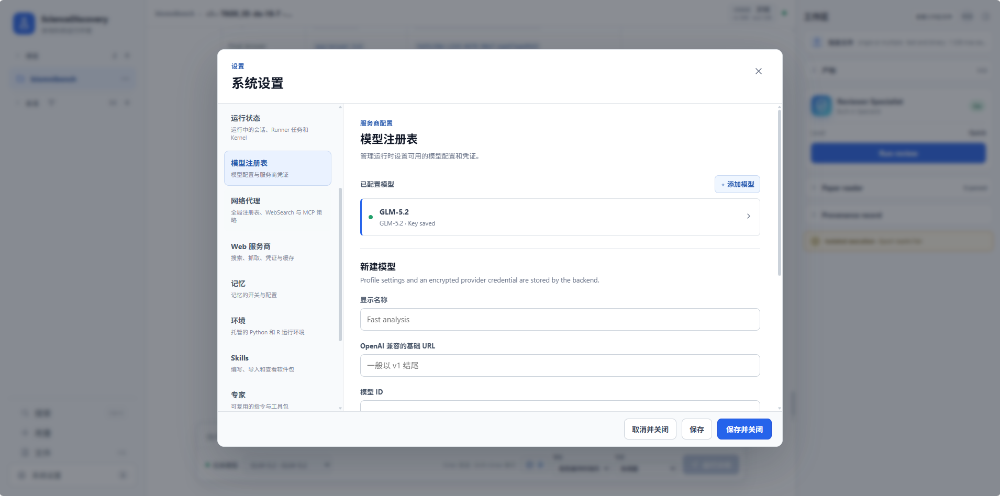
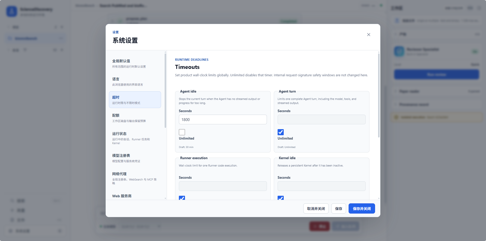
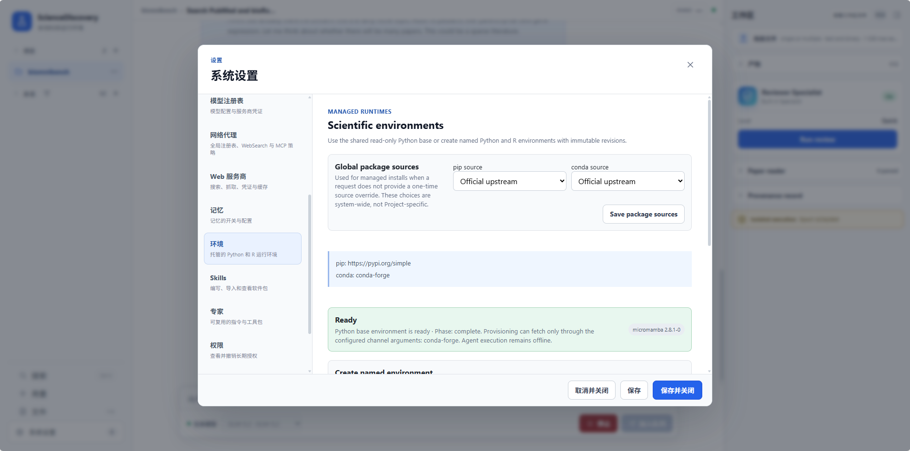
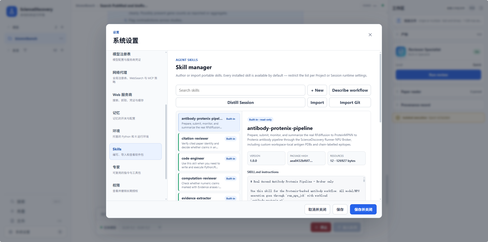
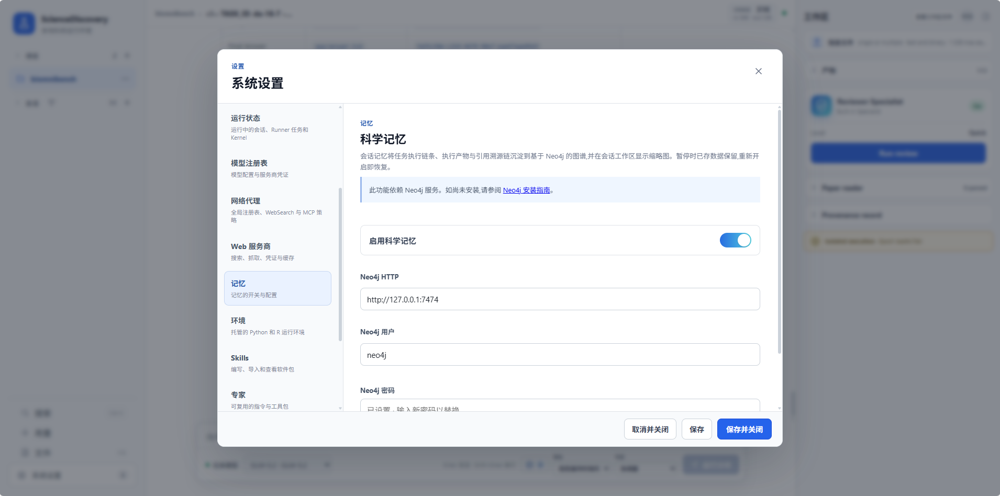
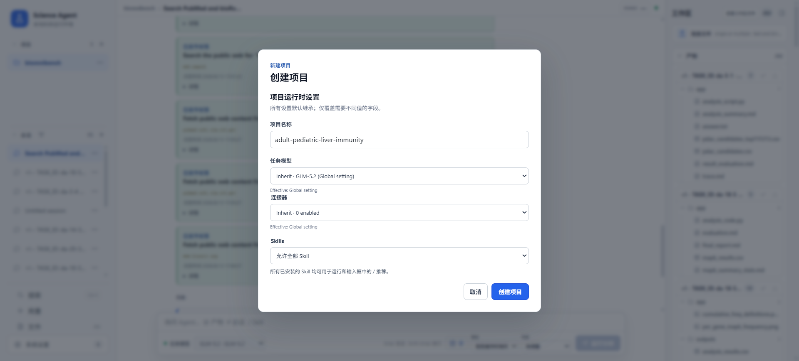
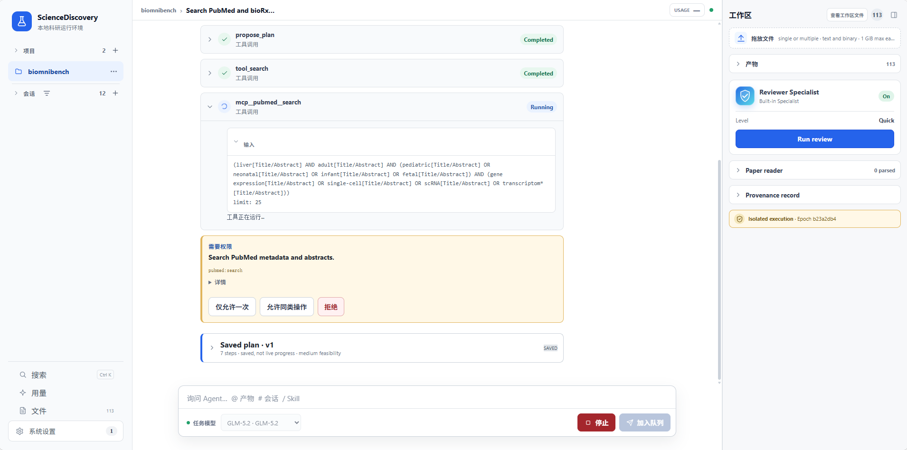

# ScienceDiscovery 使用指南：文献调研案例

本指南以一项跨数据库文献调研任务为线索，演示从启动服务、配置系统到下发任务、审批与查看结果的全流程。

## 1. 案例概述

本案例演示一项跨数据库文献调研，聚焦成人与儿童肝实质细胞的基因表达，重点关注免疫相关通路。
它检索 PubMed 中 2023–2025 年发表的论文，以及 bioRxiv 当前滚动检索范围内的近期预印本，随后生成前 14 条富集通路的
基因计数对比柱状图，并标记不同文献间的矛盾结论。

此类任务通常需要研究人员花费数天时间人工阅读与数据提取，效率低且容易遗漏。ScienceDiscovery 通过编排多种智能工具，可实现端到端自动化：

- **检索阶段**：调用文献搜索 MCP 工具，自动构建检索策略，并行查询两个数据库。
- **理解与分析阶段**：利用大模型理解文献内容，并调用代码工具完成通路富集分析与绘图。
- **追溯阶段**：整个执行过程被结构化记录于科学记忆图谱，形成可追溯的任务链。
- **撰写报告阶段**：智能体在撰写最终报告时查询图谱中已记录的真实执行链路，使每处论述都关联到支持它的证据，避免生成没有依据的结果。

---

## 2. 模型配置

进入 **系统配置 → 模型注册表**，添加模型：

| 字段 | 填什么 |
|---|---|
| 显示名 | `task-gpt5`（用户自定义） |
| Base URL | `https://api.openai.com/v1` |
| 模型 ID | `gpt-5` |
| API Key | 外部模型的 API Key。加密存在后端，UI 隐藏明文 |



---

## 3. 系统设置

### 3.1 连接器设置

连接器（Connector）是 Agent 访问外部科研数据库的入口。若未启用连接器，Agent则无法对应工具。

本案例需在 **系统配置 → Connectors**（或会话设置中的连接器面板）启用以下两项：

- **PubMed**：覆盖已发表的生物医学文献。
- **bioRxiv**：覆盖同期预印本。

其余连接器（arXiv、UniProt、Reactome 等）可以保持关闭。


### 3.2 超时设置（可选）

超时配置用于约束 Agent 在模型无响应、单轮执行、Runner 沙箱、权限等待和内核空闲这五类场景下的最长等待或运行时间，防止单点卡死拖垮整个会话。

在 **系统配置 → Timeouts** 中可分别配置以下五项：

| 字段 | 配置含义 |
|---|---|
| Agent 无响应 | 模型在指定时间内无流式输出或进度时，自动停止本轮 |
| Agent 单轮 | 单次完整回合（模型推理 + 工具调用 + 流式输出）的总时长上限 |
| Runner 执行 | 单次沙箱代码执行的墙钟上限 |
| 权限等待 | Agent 等待用户审批权限卡片的最长时间 |
| 内核空闲 | 持久 Python/R 内核在无活动时的存活时长 |



### 3.3 配额设置（可选）

配额配置用于约束 Agent 在沙箱与上传环节中可占用的资源上限，覆盖单文件大小、单次请求体积、工作区总容量与单次执行输出，防止大文件或大输出拖垮会话。

在 **系统配置 → Quotas** 或对应环境变量中可分别配置以下四项：

| 字段 | 配置含义 |
|---|---|
| Upload per file | 单个上传文件的最大体积 |
| Upload per request | 单次 multipart 上传请求体的总体积上限 |
| Workspace total | Runner 工作区累计文件的总容量上限 |
| Execution output | 单次执行 stdout + stderr 的保留上限，超限自动截断 |


### 3.4 准备 Python/R 环境

该模块用于托管 Agent 通过 `run_shell` 在沙箱中使用的 Python 与 R（`python -m`、Python 文件或 `Rscript`）。Runner 启动后会后台拉取自管 micromamba 并准备只读 base；用户可从 base 创建命名环境、按需安装包。后续更新在原环境中完成，不再 clone；每次变更记录 Revision 用于追溯。Agent 按环境 ID 选择，执行使用其最新版。

进入 **系统配置 → Environments**，Runner 首次启动会在后台下载并校验 micromamba，状态从 `provisioning` 变为 `ready`，约需数分钟。失败时页面会显示原因，可点击重试。


### 3.5 skills 设置（可选）

技能（Skill）模块用于托管 Agent 在运行中可调用的技能包。

新建技能可在 **系统配置 → Skills** 中通过以下任一方式完成：

| 方式 | 操作 |
|---|---|
| 手工编写 | 直接在管理器中新增技能包目录，填写 `SKILL.md` 与必需字段（`name` 须为小写连字符，与目录名保持一致；`description` 非空） |
| Agent 自创建 | 在对话中明确描述要创建的技能；Agent 先加载 `skill-creator`，再通过 `create_skill` 提交完整但未激活的草稿。用户在「系统配置 > Skills」逐文件审核、查看上一 revision Diff 并确认；selected 模式下还需显式启用已确认技能 |
| 自然语言草稿 | 通过自然语言描述工作流，由管理器生成可审草稿后再落地为技能包 |
| 从当前 Session 蒸馏 | 基于历史会话内容蒸馏出技能草稿，经审核后纳入技能库 |
| 本地导入 | 从本地技能文件夹、`SKILL.md` 文件或 ZIP 包导入；选择文件夹时会保留完整相对路径并打包后导入，ZIP 会校验路径穿越、符号链接、加密、重复项与体积/文件数限制 |
| Git 仓库导入 | 从 HTTPS 或 SSH 仓库 URL（可指定 ref 或子目录）导入；凭证仅在本机 credential helper 或 SSH 配置中读取，不出现在仓库 URL 或模型上下文内 |



### 3.6 专家设置（可选）

专家（Specialist）模块用于将一组固定的指令、模型、技能与连接器打包为可复用的 Agent 配置。

新建专家可在 **系统配置 → Specialists** 中完成：

1. 进入 **系统配置 → Specialists**，点击 **New specialist**。
2. 填写专家基本信息：显示名、面向的任务说明（描述 Agent 的角色与适用场景）。
3. 绑定运行所需的资源：任务模型、可选技能白名单、可选连接器白名单、可选环境与评审模型。
4. 保存后，该专家会出现在 Session 创建界面的"专家"下拉列表中，可在新建或运行会话时按名选用。

本案例不需要自定义专家，使用系统内置默认即可。

### 3.7 科学记忆（可选）

科学记忆是可选功能。它把会话的执行过程与论证过程存成图谱：研究目标、每一步任务、运行的代码、产出的文件，以及最终报告中每一条带引用的断言及其证据来源，都以节点与边的形式持久化。这样可以点击回溯一个结论与其已记录证据之间的关系。

启用与使用方式：

1. 打开 **系统配置 → 记忆**，开启 **启用科学记忆**。
2. 默认的 **本地文件** 后端无需额外服务。只有需要 Neo4j 图后端时，才选择 **Neo4j 服务**，并填写 HTTP 地址、用户名和密码。
3. 启用后，文献检索、代码运行等执行事件会自动镜像到图中，形成任务链。智能体会记录报告观点与证据、来源文献之间的引用链。
4. 在报告中点击引用标签，可打开对应证据或产物，并继续查看它在图谱中的关系。

Neo4j 的安装、存储选择和连接状态见[安装 Neo4j 与配置科学记忆](../advanced-setup/science-memory-setup.md)。



---

## 4. 创建 Project 与 Session

左侧 **新建 Project**：

- 名称：`adult-pediatric-liver-immunity`
- 描述：一句话写清目标

新建Session：进 Project → **添加会话**即可。



---

## 5. 下发任务

在对话框中输入以下任务描述：

```text
Search PubMed for papers published 2023-2025 and bioRxiv for recent preprints in its available
search window. Compare gene
expression in adult vs pediatric liver parenchymal cells. Focus on immune-related
pathways. Generate a pathway enrichment bar chart showing gene count comparison
between the two populations for the top 14 enriched pathways. Flag any
contradictory findings across studies. In the report, state the number of records returned by each
source and the publication years represented in the bioRxiv results.
```

点击 **运行分析**。

---

## 6. 审批与权限

任务运行时，Agent 在执行高风险操作前会暂停并弹出权限卡片，等待用户审批。下表列出常见的审批类型及其含义：

| 审批类型 | 含义 |
|---|---|
| code | Agent 调用 `run_shell` 在沙箱中执行代码 |
| connector | Agent 调用 MCP 工具（如 `mcp__pubmed__search`、`mcp__biorxiv__search`）访问外部科研数据库 |
| download | Agent 调用 `artifact_download` 下载候选文件到工作区 |
| extraction | Agent 调用 `paper_extract_pdf` 抽取已下载 PDF 的文本与表格 |
| scientific-environments | Agent 调用 `environment_install` 等托管环境变更工具 |
| web | Agent 调用 `web_search` 或 `web_fetch` 发起公网请求 |

权限卡片提供 **仅允许一次**、**允许同类操作**和 **拒绝**。选择“允许同类操作”会为当前 Session
中相同操作和标准化资源类别的后续请求创建可撤销授权，可在系统配置的权限面板中查看或撤销。



---

## 7. 查看结果

智能体输出一份带有可点击引用标签的报告。每个标签对应其引用内容、来源文献与执行链路，因此可沿已记录证据检查报告中的论述。图谱让结果可追溯、可复核，将原本需要数天的文献调研缩短到分钟级，避免报告生成过程成为不可查看依据的黑箱。

### 7.1 查看产物

在右侧产物栏打开产物（Markdown 报告）。报告正文里出现的 Evidence 引用均为可点击的 chip。


### 7.2 查看 Evidence

点击任意 Evidence chip，会打开 Evidence 卡片。卡片提供三个入口：

| 入口 | 用途 |
|---|---|
| **Preview** | 查看 Evidence 的内容 |
| **Provenance** | 查看 Evidence 的溯源信息，包括生成该 Evidence 所引用的代码、执行环境、执行日志等 |
| **在科学记忆中查看此证据** | 查看与该 Evidence 相关的科学记忆图谱信息 |


### 7.3 查看生成链与引用链

点击 **在科学记忆中查看此证据**，可进一步查看该 Evidence 的两条链路：

- **生成链**：从研究目标出发，沿任务节点追溯到生成该 Evidence 的代码与执行记录。
- **引用链**：从 Evidence 上溯至其来源文献，以及声明该 Evidence 的 Artifact / 报告断言。

