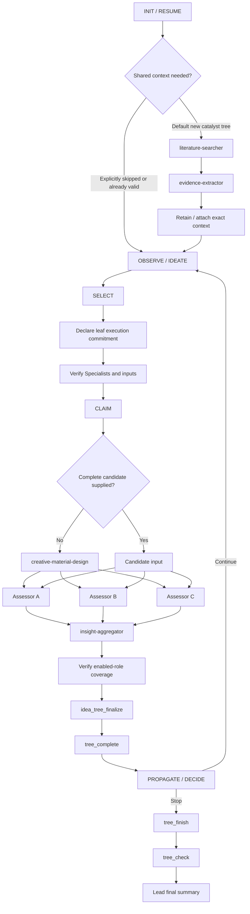

# Workflow: Idea Tree

## Control Rule

The Lead is a Coordinator. The user prompt controls research scope and may explicitly enable, skip, or narrow stages; this workflow controls who performs every enabled stage.

- For catalyst design, the default profile is the complete evidence-and-review pipeline defined below.
- An explicitly skipped stage is omitted. Its work is not reassigned to the Lead.
- An enabled stage must run under a role-appropriate Specialist. Missing or failed Specialist work cannot be replaced by Lead reasoning.
- Before claiming a leaf, the Lead must have a Specialist execution plan capable of producing the score and insight required by `idea_tree_finalize`.
- Do not infer orchestration from `executor.preflightRoles`, `executor.leafRoles`, or old checkpoint names; those fields remain only for persisted compatibility.
- The required tree lifecycle is: discover/create tree → resolve profile and shared context → build/select a terminal leaf → commit and claim → dispatch Specialists → verify role coverage → `idea_tree_finalize` → `tree_complete` → propagate → decide whether to continue or call `tree_finish` → `tree_check` → Lead summary.



## Default Catalyst Workflow Profile

Unless the user explicitly changes the stages, use this profile:

| Phase | Role | Specialist | Purpose |
|---|---|---|---|
| Shared context | literature | `builtin-literature-searcher` | Retrieve relevant academic sources |
| Shared context | evidence | `builtin-evidence-extractor` | Extract structured evidence from the source package |
| Leaf | creative | `builtin-creative-material-design` | Produce the concrete candidate for the claimed hypothesis |
| Leaf | assessor-activity | `builtin-assessment-screener` | Independently evaluate the activity perspective |
| Leaf | assessor-stability | `builtin-assessment-screener` | Independently evaluate the stability perspective |
| Leaf | assessor-sustainability | `builtin-assessment-screener` | Independently evaluate the sustainability perspective |
| Leaf | aggregator | `builtin-insight-aggregator` | Cross-validate enabled assessments and produce terminal leaf insight |

The table fixes role ownership and ordering for enabled stages. It does not define scoring arithmetic, require a particular Artifact count, or make optional Runtime compatibility fields authoritative.

## Coordinator and Specialist Boundaries

### Lead-owned work

- Discover or resume the tree and inspect authoritative state.
- Observe existing evidence, failures, and propagated insights.
- Create broad directions and executable leaf hypotheses.
- Select, commit, claim, dispatch, validate role coverage, complete, propagate, prune, retry, finish, and summarize.
- Synthesize internal-node and ROOT insight from already completed child insights.

### Specialist-owned work

- Literature retrieval and source packaging.
- Evidence extraction from known sources.
- Concrete candidate design and its scientific design rationale.
- Candidate scoring or perspective-specific evaluation.
- Cross-validation and synthesis of multiple assessments inside one leaf.

A leaf hypothesis may be specific enough to name a material concept or mechanism. It crosses the boundary when it becomes a final candidate description, assessment, score, or cross-assessment conclusion.

## Step 0: INIT or RESUME

1. Call `tree_list`; do not depend on a remembered tree id.
2. If a current tree exists, call `tree_view` and continue its valid state.
3. Otherwise resolve the active workflow profile, verify its required Specialists, and call `tree_create` with objective, root hypothesis, and bounded limits.
4. Use the default catalyst profile unless the user explicitly enables, skips, or narrows stages.
5. On resume, reuse exact valid shared context or checkpoints when available. Do not repeat completed work merely because a legacy `preflightStatus` field says `running`.

## Step 1: SHARED CONTEXT

For a new catalyst tree, literature and evidence are enabled by default.

1. Dispatch `builtin-literature-searcher` for the scoped research objective.
2. Dispatch `builtin-evidence-extractor` with the literature result or exact source package.
3. Retain the exact outputs for downstream task briefs. When durable Artifact versions are available and useful, call `tree_attach_context` with those exact identities before the first leaf execution.
4. If the user explicitly skips literature but supplies suitable sources, evidence extraction may run directly on those sources.
5. If evidence extraction is enabled without any source input, stop and report the missing dependency; the Lead must not create evidence itself.

Artifacts remain optional durability and provenance mechanisms. When an Artifact is used, preserve its exact `artifact_id` and `version_id` throughout downstream dispatch.

## Step 2: OBSERVE AND IDEATE

Call `tree_view` before each decision cycle. Inspect revision, remaining limits, eligible leaves, retry states, completed insights, shared context, and pending propagation.

Create legal nodes with `tree_add_node`. Priority is an ordering hint, not a scientific score. The Lead may formulate concrete, executable hypotheses, but it must leave candidate construction and evaluation to the enabled leaf Specialists.

A claimable leaf has:

```text
status == pending
searchStatus == active
childrenIds is empty
depth == maxDepth
```

Finish pending propagation before ideation, claim, retry, prune, or finish.

## Step 3: SELECT, COMMIT, AND CLAIM

Use `tree_select` or the pending view to choose the best leaf. Before claiming it, state this commitment:

```text
Leaf: <node id and hypothesis>
Enabled stages: <ordered roles and specialist ids>
Skipped stages: <explicit user instruction and effect>
Inputs: <shared context, candidate, or exact Artifact versions>
Parallel group: <independent tasks, if any>
Terminal output source: <Specialist output that supplies score and insight>
```

Validate before claim:

- every enabled role has an available, role-appropriate Specialist;
- every chained stage has an available upstream input;
- independent tasks can use the same immutable input without sharing their outputs;
- the enabled flow can produce both a terminal score and a terminal insight.

If any condition fails, do not claim. Report the missing capability or ask the user to change the stage selection.

Call `tree_claim` with the latest revision only after the commitment is viable. Claiming consumes one search round and freezes the objective, hypothesis, ancestor insights, and optional shared context.

## Step 4: DISPATCH LEAF SPECIALISTS

### 4.1 Task brief contract

Every Specialist dispatch must identify:

- research objective and exact leaf hypothesis;
- the Specialist's single role and prohibited adjacent roles;
- exact upstream output, path, or Artifact identity;
- ancestor insights and shared context needed for the assignment;
- requested assessment perspective when applicable;
- expected terminal fields or handoff required by the next stage.

Do not ask one Specialist to impersonate multiple independent roles.

### 4.2 Candidate

- If the user supplied a complete candidate suitable for evaluation, use it as the immutable candidate input and record that the creative stage was explicitly satisfied by user input.
- Otherwise dispatch `builtin-creative-material-design`.
- The Lead may validate that a candidate was returned and matches the leaf assignment. It must not write or repair the candidate itself.

### 4.3 Independent assessments

The default catalyst profile dispatches three separate `builtin-assessment-screener` executions for activity, stability, and sustainability.

- Give every Assessor the same exact candidate input.
- Do not give an Assessor another Assessor's scores, reasoning, or output.
- Run independent assessments in parallel when the task budget and harness allow it.
- An explicitly narrowed set of perspectives is allowed only when requested by the user and recorded in the commitment.

### 4.4 Leaf aggregation

- After every enabled assessment completes, dispatch `builtin-insight-aggregator` with their exact outputs.
- Aggregation is mandatory when multiple assessment outputs must become one terminal leaf insight.
- A custom single-evaluator flow may omit aggregation only when that evaluator already provides the complete terminal score and insight declared in the commitment.
- The Lead must not cross-validate, resolve disagreements, or synthesize missing assessment results itself.

### 4.5 Optional durability

Important outputs may be declared as Artifacts and checkpointed with workflow-defined `step_key` values. `tree_checkpoint` is for retry/recovery convenience; the Runtime does not require a fixed candidate, assessment, or aggregation checkpoint sequence.

When reusing a checkpoint, verify that its immutable inputs and exact output version still match the current execution.

### 4.6 Role-coverage validation

Before finalization, confirm:

- every enabled stage has a completed execution under the committed Specialist id;
- every assessment used the committed candidate input;
- independent assessments came from distinct subagent executions;
- aggregation covers every enabled assessment;
- terminal score and insight are present in the designated Specialist output.

The Lead may reject malformed or mismatched output and retry the same role. It must not repair scientific content, invent terminal values, or replace the role with direct reasoning.

## Step 5: FINALIZE AND COMPLETE

Call `idea_tree_finalize` with:

- claimed `tree_id`, `execution_id`, `attempt`, and `request_hash`;
- the score and semantic insight produced by the committed Specialist workflow;
- optional exact Artifact identities worth retaining with the result.

This workflow does not define or recompute scoring rubrics. The Lead may select and forward the designated terminal fields, but it must not calculate a missing score or author a missing insight.

The finalizer binds the result to the active execution, validates the score range, and verifies any supplied Artifact versions. Pass only its returned `result_handle` to `tree_complete`.

## Step 6: FAIL, RETRY, AND PROPAGATE

- For an operational or Specialist failure, call `tree_fail`; use `retryable=true` only when repeating the same role can meaningfully recover.
- For `needs_retry`, call `tree_retry`, claim again, and resume from exact valid inputs or checkpoints.
- A retry preserves role ownership. Do not replace a failed Specialist with the Lead.
- Under token or time pressure, reduce breadth, stop, or ask the user to narrow stages. Do not silently collapse independent roles into Lead reasoning.
- After completion, update the first pending propagation node with `tree_update_node` and the exact `propagation.childDigest`.
- Internal-node insight must synthesize completed child insights only. Do not re-evaluate raw candidates, recompute leaf scores, or treat system failures as scientific evidence.

## Step 7: DECIDE, FINISH, AND SUMMARIZE

Choose the next useful action: execute, expand, retry, prune, or stop. Stop when a hard limit is reached, no valuable work remains, marginal information gain is low, or the user asks.

Once stopping is justified:

1. Complete all pending propagation.
2. Call `tree_finish` with the latest revision.
3. Run `tree_check`.
4. Have the Lead summarize the authoritative tree state for the user: objective, executed and skipped stages, completed/pruned/failed leaves, strongest outcomes, ROOT insight, unresolved caveats, and integrity status.

The final summary is Coordinator work and remains owned by the Lead. Do not dispatch a report-writing subagent for this workflow.
