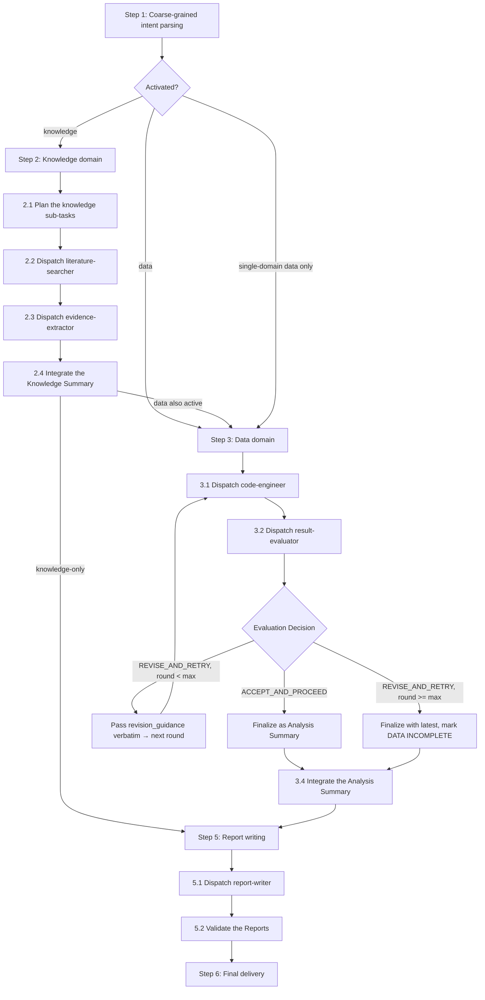

# Workflow: multi-domain team orchestration

## Overview



## Detailed Steps

### Step 1 — Coarse-grained intent parsing

1. Parse the user's request to identify which domains to activate — knowledge research, data analysis, and/or reports — and capture the scope constraints for each activated domain. If both knowledge and data are needed, knowledge runs first so its report can be passed as feed-forward to the data domain.
2. Verify that every required sub-agent and its supporting skill actually exist. Each role is a built-in specialist; dispatch it by passing its `specialistId` to the `task` tool so its fixed instructions, skills, and connectors are applied.

| Domain | Required Sub-agent | specialistId | Required skill |
|---|---|---|---|
| Knowledge | `literature-searcher` | `builtin-literature-searcher` | `skills/literature-searcher/` |
| Knowledge | `evidence-extractor` | `builtin-evidence-extractor` | `skills/evidence-extractor/` |
| Data | `code-engineer` | `builtin-code-engineer` | `skills/code-engineer/` |
| Data | `result-evaluator` | `builtin-result-evaluator` | `skills/result-evaluator/` |
| Report | `report-writer` | `builtin-report-writer` | `skills/report-writer/` |

**Existence check only** — for each required skill, confirm two things and stop: (1) the skill directory exists, (2) it contains a `SKILL.md`. Do NOT read the skill's contents here; that is the sub-agent's own job when it runs, and reading it now wastes context.

**Dispatching** — when launching a role, always pass its `specialistId` (from the table above) to the `task` tool. The specialist carries the role's fixed system prompt; the brief and prompt you pass are the task-specific goal and inputs. Do not rely on `subagent_type` alone.

**On missing sub-agent or skill** — pause the task and tell the user which one is missing, then wait for the user to configure it before continuing. Do NOT silently fall back to writing the missing piece yourself.

**Requirements**:
- The activation plan must be explicit and unambiguous
- All required sub-agents and skills must be available
- If the request is too vague, surface to the user before activating any domain

### Step 2 — Knowledge domain (if activated)

Run knowledge discovery and evidence extraction, then integrate findings into a Knowledge Summary. The report flows downstream as feed-forward to data analysis or as input to the report-writer.

#### Step 2.1 — Plan the knowledge sub-tasks

1. Decompose the knowledge objective into sub-tasks, each scoped to exactly one sub-agent. **Each sub-agent supports multiple parallel instances** — the plan decides how to partition the work across them:
   - **Search sub-tasks** for `literature-searcher` — partition the source space along one or more axes: by database (PubMed, arXiv, clinical trials registry), by query variant, by time window, by source type (peer-reviewed, preprints, conference proceedings). Multiple search sub-tasks can run in parallel.
   - **Extract sub-tasks** for `evidence-extractor` — partition the search results along one or more axes: by source cluster, by aspect (methods, results, limitations), by relevance tier. Multiple extract sub-tasks can run in parallel once their upstream search completes.
2. Map chained-input references (e.g., evidence-extractor needs literature-searcher's output before it can start). Chaining flows: search → extract (extract waits for search to finish).
3. Schedule the sub-tasks:
   - **Independent sub-tasks** (no shared inputs) → run in parallel
   - **Chained sub-tasks** → run sequentially after their upstream completes
   - The plan is a DAG (directed acyclic graph) of sub-tasks grouped by execution stage

   **Worked Example** — objective: "summarize recent advances in mRNA vaccines":
   - 3 searcher→extractor chains run in parallel. Within each chain the extractor is sequenced after its paired searcher, but chains do NOT wait on each other — as soon as one searcher returns, its paired extractor can fire without waiting for the other searchers to finish:
      - Chain A — `literature-searcher` against PubMed: query "mRNA vaccine efficacy", years 2020–2024 → `evidence-extractor` on PubMed results → clinical efficacy findings
      - Chain B — `literature-searcher` against bioRxiv: query "mRNA vaccine", years 2023–2024 → `evidence-extractor` on bioRxiv results → mechanism-of-action findings
      - Chain C — `literature-searcher` against clinical trials registry: query "mRNA vaccine" → `evidence-extractor` on trials registry results → ongoing trial data

**Requirements**:
- Every sub-task has a non-empty description and an explicit sub-agent role
- Chained-input references are complete (no sub-task depends on an output that hasn't been planned)
- Independent sub-tasks are dispatched in parallel; chained sub-tasks wait for their upstream
- The plan covers the full knowledge objective or explicitly excludes parts with rationale

#### Step 2.2 — Dispatch literature-searcher

1. Launch literature-searcher via the `task` tool, setting `specialistId=builtin-literature-searcher`, with the sub-task brief (see input format below) — inputs are passed in the task prompt directly
   - Input Format
   ```markdown
   ### Research Topic
   [required — research question or topic]

   ### Domain
   [required — BIOMEDICINE | CHEMISTRY | MATERIALS | FINANCE | COMPUTER_SCIENCE | GENERAL]

   ### Python Environment
   [required — conda env name, venv path, or uv environment identifier to execute under.]

   ### Time Range  *(optional)*
   - Start: YYYY-MM-DD or no limit
   - End: YYYY-MM-DD or no limit

   ### Language  *(optional)*
   [preferred languages, for example en or en+zh]

   ### Source Type  *(optional)*
   [academic_paper, preprint, report, clinical_study, etc.]

   ### Minimum Sources  *(optional)*
   [number, default 5]

   ### Scope Constraints  *(optional)*
   [additional inclusion/exclusion criteria]

   ### Output Directory  *(optional)*
   [directory for JSON artifacts; default /mnt/user-data/outputs/literature-searcher]
   ```
2. Receive literature-searcher's output directly from the task result
3. Validate the output according to the following rules:
   - **Source relevance** — every source addresses the research objective; titles and abstracts align with the question
   - **Authoritative provenance** — sources carry author(s), year, title, venue/journal, and a stable identifier (DOI/PMID/URL)
   - **Coverage diversity** — sources span multiple perspectives, methods, or populations rather than a single lab or view

   **On failure** — retry this sub-task with sub-task brief, last try's output, and a modified suggestion. (max 1 retry)

#### Step 2.3 — Dispatch evidence-extractor

1. Launch evidence-extractor via the `task` tool, setting `specialistId=builtin-evidence-extractor`, with the sub-task brief (see input format below) — inputs are passed in the task prompt directly
   - Input Format
   ```markdown
   ### Evidence Extraction Assignment
   [required — research objectives and questions that drive extraction]

   ### Source Package
   [required — path to literature_sources.json, or embedded source list from literature-searcher]

   ### Python Environment
   [required — conda env name, venv path, or uv environment identifier to execute under.]

   ### Domain Context  *(optional)*
   [BIOMEDICINE | CHEMISTRY | MATERIALS | FINANCE | COMPUTER_SCIENCE | GENERAL; defaults to GENERAL if omitted]

   ### Extraction Strategy Hint  *(optional)*
   [full | statistical | mechanistic | theoretical]

   ### Source Content  *(optional)*
   [full text, abstracts, snippets, uploaded PDFs, or accessible source excerpts]

   ### Output Directory  *(optional)*
   [directory for evidence JSON artifacts]
   ```
2. Receive evidence-extractor's output directly from the task result
3. Validate the output according to the following rules:
   - **Evidence relevance** — each extracted finding directly addresses the research objective
   - **Provenance** — every finding has an author + year + DOI/URL/source, not vague "studies show"
   - **Resolvable citations** — citation chains are traceable to a primary source, or flagged as untraceable

   **On failure** — retry this sub-task with sub-task brief, last try's output, and a modified suggestion. (max 1 retry)

**Requirements**:
- literature-searcher's output must already be in hand before launching evidence-extractor

#### Step 2.4 — Integrate the Knowledge Summary

Stitch sub-agent outputs into a single Knowledge Summary(see summary format below) according to the following rules:
   1. **Schema rule** — all required sections present, no placeholder text
   2. **Content rule** — addresses the scoped objective, no off-topic content, no new claims outside the knowledge domain, provenance for every finding

**Knowledge Summary Format**
```markdown
### Knowledge Findings
[Source-supported claims that answer the research objective; each tied to one or more sources via provenance.]

### Methods Used
[How the evidence was gathered — databases queried, search terms, screening criteria, time window.]

### Evidence Landscape
[Overview of the field's coverage — which sub-topics have strong evidence, which have weak or conflicting evidence.]

### Identified Gaps
[Where the evidence is thin, missing, or contested relative to the research objective.]
```

**Requirements**:
- Do Not change anything you recieved from sub-agents, you only need to integrate the report.
- Save the integrated Knowledge Summary as a readable file (e.g., `knowledge_summary.md`).

### Step 3 — Data domain (if activated)

Run computational analysis through an evaluate-and-revise loop, then finalize the result as an Analysis Summary. The report flows downstream to the report-writer. **You MUST read [analysis-principles.md](analysis-principles.md) before performing any data analysis**.

#### Step 3.1 — Dispatch code-engineer (round 1)

1. Launch code-engineer via the `task` tool, setting `specialistId=builtin-code-engineer`, with the analysis sub-task brief (see input format below) — inputs are passed in the task prompt directly
   - Input Format
   ```markdown
   ### Analysis Objective
   [required — what this code-engineer run should answer]

   ### Available Data
   [required — file path(s), data description, format details, known quality issues]

   ### Python Environment
   [required — conda env name, venv path, or uv environment identifier to execute under.]

   ### Evaluation Criteria  *(optional)*
   [dimensions that matter (correctness, methodology, robustness, etc.)]

   ### Knowledge Summary  *(optional — include only if dual-domain)*
   [Knowledge Summary from Step 2]

   ### Revision Guidance  *(optional — include only if round > 1)*
   [Revision Guidance from result-evaluator]
   ```
2. Receive code-engineer's output directly from the task result
3. Validate the output:
   - **Code executed** — actual executed code is present, not a bare "code ran" claim
   - **Artifacts produced** — concrete outputs (numbers, plots, tables, files) are saved, not abstract descriptions

   **On failure** — ask code-engineer to re-emit (max 1 retry)

#### Step 3.2 — Dispatch result-evaluator

1. Launch result-evaluator via the `task` tool, setting `specialistId=builtin-result-evaluator`, with the evaluation sub-task brief (see input format below) — inputs are passed in the task prompt directly
   - Input Format
   ```markdown
   ### Analysis Result
   [required — the code-engineer output package from Step 3.1, presented as the following sub-sections]

   #### Structured Results
   [required — JSON / CSV / MD export of the numerical/tabular findings from code-engineer]

   #### Methodology Documentation
   [required — libraries and statistical methods used; method justification; key transformations and function calls]

   #### Data Traceability
   [required — source file names, sheet/column names, row counts, transformations applied to the data]

   #### Analysis Code
   [required — the full code used to produce the results, passed for the Phase-3 reproducibility audit]

   #### Analysis Plan Context  *(optional)*
   [domain, background information, and any other context that shapes how the result should be interpreted]

   ### Python Environment
   [required — conda env name, venv path, or uv environment identifier to execute under.]

   ### Evaluation Criteria  *(optional)*
   [criteria to apply to this round's result]
   ```
2. Receive result-evaluator's output directly from the task result
3. Validate the output:
   - **Decision present** — `decision` field is `ACCEPT_AND_PROCEED` or `REVISE_AND_RETRY`
   - **Revision guidance when REVISE** — if `REVISE_AND_RETRY`, revision guidance is present and actionable

   **On failure** — ask for re-emit (max 1 retry).

#### Step 3.3 — Iterate or finalize

1. If the decision is `ACCEPT_AND_PROCEED`:
   - go to Step 3.4
2. If the decision is `REVISE_AND_RETRY` and the current round is below `max_engineer_evaluator_iterations`(default as 3):
   - Increment the round
   - Re-launch code-engineer via the `task` tool with the original objective + data description + evaluation criteria + revision guidance passed verbatim
3. If the decision is `REVISE_AND_RETRY` and the cap is hit:
   - Finalize with the latest output from code-engineer and mark `[DATA INCOMPLETE — iteration cap]`

**Requirements**:
- revision guidance MUST be passed verbatim — no paraphrase, no summary, no omission
- The evaluation criteria stay fixed across rounds
- You must not add new scope, change the assignment, or inject new constraints beyond what revision guidance says

#### Step 3.4 — Integrate the Analysis Summary

Stitch the accepted output from code-engineer into a single Analysis Summary (see summary format below) according to the following rules:
   1. **Schema rule** — all required sections present, no placeholder text
   2. **Content rule** — addresses the scoped objective, no fabricated data, no off-scope analysis

**Analysis Summary Format**
```markdown
### Objective
[The specific analysis objective this Summary addresses.]

### Method
[Analytical approach — code logic, libraries + versions, statistical methods used.]

### Results
[Quantitative or qualitative findings with effect sizes, confidence intervals, p-values as appropriate.]

### Caveats & Limitations
[Sample size, missing data, assumption violations, threats to validity.]

### Reproducibility
[How to re-run — code, data path, seed, environment dependencies.]
```

**Requirements**:
- Do Not change anything you recieved from code-engineer, you only need to integrate into the Summary format.
- Save the integrated Analysis Summary as a readable file (e.g., `analysis_summary.md`).

### Step 5 — Report writing

Always dispatch the report-writer to produce outputs. If the user specified output files, formats, or content constraints in their original request, pass them through to the report-writer; otherwise dispatch with no additional requirements and let the report-writer apply its defaults.

#### Step 5.1 — Dispatch report-writer

1. Launch report-writer via the `task` tool, setting `specialistId=builtin-report-writer`, with the dispatch brief (see input format below) — inputs are passed in the task prompt directly
   - Input Format
   ```markdown
   ### Domain Summaries
   [required — path to `knowledge_summary.md` if knowledge domain was activated, path to `analysis_summary.md` if data domain was activated; at least one Domain Summary is required]

   ### Python Environment
   [required — conda env name, venv path, or uv environment identifier to execute under.]

   ### Format Expectation  *(optional — only if the user specified one)*
   — file name, file format, file location, etc. that the user requested. Omit the section entirely if the user did not specify any.

   ### Constraints  *(optional — only if the user specified any)*
   — audience, length, language, etc. that the user requested. Omit the section entirely if the user did not specify any.
   ```
2. Receive report-writer's output file paths directly from the task result

**Requirements**:
- The output files are produced by the report-writer, not by you
- Do NOT impose your own format or scope preferences — only forward what the user requested (or nothing, if the user requested nothing)

#### Step 5.2 — Validate the Reports

Run the validations on the report:
   - **Match User's Requirements** - if user has specified required file name, file format
   - **Traceability** — every finding traces to a source role
   - **No new claims** — the report cites, formats, and synthesizes without introducing claims absent from the domain reports
   - **Contradictions surfaced** — inter-domain contradictions are listed verbatim, not silently resolved

   **On failure** — ask for re-emit (max 1 retry).

### Step 6 — Final delivery

Deliver whatever the report-writer produced to the user, with:
   - Which domains ran, which round finalized each
   - Any unresolved issues
   - The iteration trail (`accepted` / iteration cap / format error / kick-back retry)
