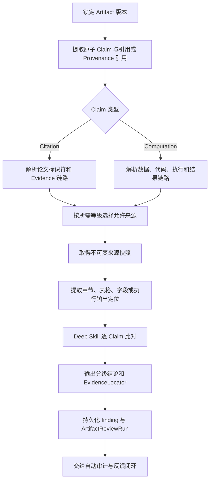

# Reviewer Specialist：全链路科研证据核验设计

> 状态：提案。目标是在现有 Deep 的 Evidence 与摘要级审核之上，补齐全文、表格、补充材料、原始数据和执行产物级的可定位核验。

## 1. 目标与边界

现有 Deep 能核验论文身份、摘要/受控来源信息，以及带 `[evN]` 的 Claim 与已登记 Evidence 是否一致；它不能证明某个具体结论或数字确实出自论文全文、表格、补充材料、原始数据或一次真实执行。

本方案把 Deep 扩展为“按 Claim 所需证据等级审计”，输出绑定来源快照和定位信息的分级结论。它不是新增档位：用户仍只选择 Quick 或 Deep；来源级能力是 Deep 在依赖、权限和预算允许时提高证据深度的执行策略。

不在本方案中重新实现审核自动触发、后台任务或 Lead Agent 反馈；这些由《自动证据审计与反馈闭环设计》提供。本方案产出的 `ArtifactReviewRun` 和 finding 直接进入该闭环。

## 2. 证据等级与结论

| 等级 | 可用证据 | 可可靠核验的 Claim |
|---|---|---|
| E0 | 标识符与元数据 | 论文或数据对象是否存在、身份是否匹配。 |
| E1 | 摘要与已登记 Evidence | 一般背景或高层结论。 |
| E2 | 全文正文与图注 | 方法、结果、机制及限定条件。 |
| E3 | 表格、图片、补充材料 | 数值、样本量、P 值、置信区间、亚组与具体比较。 |
| E4 | 原始数据、代码、执行记录和结果产物 | 计算是否真实执行，以及 Artifact 数字是否对应真实结果。 |

每个 Claim 由规则与 Deep Skill 共同确定 `requiredEvidenceLevel`。来源证据未达到该等级时，结论只能是 `INCONCLUSIVE`，不能因“主题相关”给出支持结论。

统一输出：

```text
SUPPORTED            证据达到要求且支持 Claim
PARTIALLY_SUPPORTED  证据支持部分范围或结论
CONTRADICTED         可定位来源明确矛盾
INCONCLUSIVE         证据不足、权限不足、来源不可用或无法定位
```

`CONTRADICTED` 才可作为强内容问题；`INCONCLUSIVE` 和服务降级必须保留为独立状态。

## 3. 来源级核验流程



### 3.1 可定位证据

每条支持、部分支持或矛盾结论都必须包含至少一个 `EvidenceLocator`：

```text
sourceType(paper|supplement|dataset|code|execution|artifact), sourceId,
snapshotHash, locator(page|section|paragraph|table|row|column|figure|field|run|outputPath),
excerpt, retrievedAt, evidenceLevel
```

`snapshotHash` 将判断绑定到当时读取的不可变内容；`excerpt` 只保存必要、可展示的短片段。对无权访问的全文、私有数据或已失效链接，只记录最小错误摘要和 `INCONCLUSIVE`，不保存敏感原文。

## 4. Citation 来源级核验

Citation Reviewer 以“论文身份 → Claim 所需等级 → 可定位证据 → 分级结论”为固定顺序：

1. 用 DOI、PMID、PMCID、arXiv 或规范化元数据完成 E0 身份核验；
2. 为 Artifact 中的复合叙述拆分原子 Claim，并识别其需要摘要、全文还是表格级证据；
3. 在受治理的全文、图片、表格和补充材料来源中建立快照；
4. 以页码、章节、表格单元或图注定位证据；
5. 仅在来源明确支持、部分支持或矛盾时输出对应结论；否则输出 `INCONCLUSIVE`。

来源获取必须遵从现有 Connector、权限和版权边界；Reviewer 不得通过任意 Shell、文件写入或未授权抓取绕过治理。

## 5. Computation 来源级核验

Computation Reviewer 沿 Provenance 链路核验：

```text
Artifact Claim
  → Evidence / 生成数据 Artifact
  → 输入数据版本、代码版本、参数与 ExecutionRun
  → 标准化结果或原始输出字段
```

它首先确认 E4 链路存在，再把 Claim 的数值、单位、分组、人群、时间范围和统计口径与定位到的结果字段比较。首期只读真实执行产物，不重新运行代码；受控重算可作为后续独立能力，不能阻塞来源级核验首期。

## 6. 安全、成本与复用

- 每个来源获取、解析和 Claim 比对都有独立超时、体积上限和取消信号；
- Deep 仅访问策略白名单中的来源，子 Agent 无 Shell、写文件、执行代码或派生 Agent 权限；
- 可复用来源身份和不可变快照；Claim 文本、要求等级、定位上下文、来源快照或 Skill/policy 变化时必须重新判断；
- 先按 Artifact 串行、按 Claim 小批次处理，并持久化阶段结果；失败后能复用已完成的来源快照与 Claim 结果；
- 日志做脱敏与长度裁剪，禁止把原始数据、令牌或整篇受版权保护全文写入日志。

## 7. 实现拆分

### PR4：Citation 全文、表格与补充材料

- 建立 `EvidenceLocator`、来源快照和 Citation 证据等级协议；
- 接入受治理的全文/补充材料获取和解析；
- 实现 Citation 原子 Claim 的 E0–E3 定位、结论和复用；
- 以 PDF、HTML、表格和补充材料 fixture 覆盖支持、部分支持、矛盾和证据不足。

### PR5：Computation 原始数据与执行产物

- 扩展 Provenance 查询以返回数据、代码、参数、ExecutionRun 和结果位置；
- 建立数据字段、结果表格、文件路径和运行输出的 E4 locator；
- 实现 Claim 与真实结果的只读比对，以及链路缺失/执行失败的降级；
- 覆盖数据版本变化、代码变化、单位/范围不一致和结果字段定位。

### PR6：统一评测与端到端验收

- 统一 Citation / Computation finding 的分级结论和展示；
- 把来源级结果接入自动审计与 Lead Agent 反馈闭环；
- 覆盖真实或等价受控 MCP/Web、Memory Graph、权限拒绝、取消、重启恢复与跨 Session 并行；
- 建立可重复的科研报告评测集，衡量定位成功率、误报率、`INCONCLUSIVE` 合理性和修订闭环成功率。

## 8. 验收标准

- 每个需要 E2–E4 的通过或矛盾结论都能回链到不可变来源快照和具体位置；
- 仅有摘要时，不得为需要表格、补充材料或原始数据的数字 Claim 输出 `SUPPORTED`；
- 来源不可用、权限不足或解析失败必须输出 `INCONCLUSIVE`，且不影响 Artifact 交付；
- 原始数据、代码、运行记录和结果产物只能只读访问，并记录版本与定位；
- 相同 Claim 与来源快照可复用，不同版本或不同上下文不会错误复用；
- 来源级 finding 能被自动审核任务、Reviewer 卡片和 Lead Agent 安全反馈一致消费。
