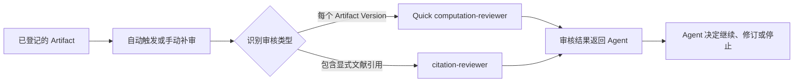
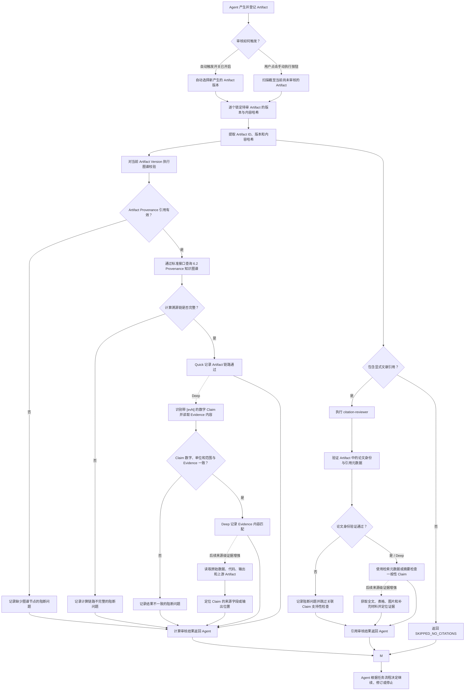
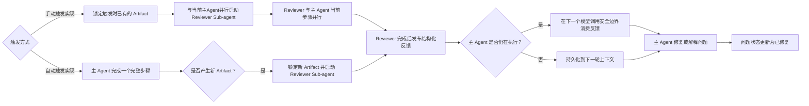

# Reviewer 技术方案总构图

> 状态更新：[#122](https://gitcode.com/mindspore/ScienceAgent/pull/122) 已合入。Quick/Deep、当前 Session 范围、Markdown/JSON 路由、持久化结果及取消语义均已实现；正文保留原始设计与后续路线。

## 1. 总体编排结构

`Reviewer Specialist` 基于 `computation-reviewer` 和 `citation-reviewer` 两个模块实现：前者负责计算真实性与数据一致性审核，后者负责论文真实性与论文—陈述匹配性审核。两个 Reviewer 可以独立执行，并分别将审核结果返回给 Agent。

### 审核对象范围

审核入口只收集**当前 Session** 产生的 Artifact，不扫描项目内其他 Session 的历史产物。
叙述型 Markdown 报告可进入 Citation 与 Evidence 语义审核；`sources.json` 等中间元数据或
来源清单只做 JSON 可解析性和 Artifact 图谱链路检查，不作为 Citation、数值 Claim 或 Evidence
语义审核的对象。

Reviewer 的审核对象仅限于 Agent 实际产生、已落盘并完成登记的 `Artifact`。每次审核必须绑定明确的 `artifact_version_id` 和内容哈希，不能以聊天轮次或未固化的文本作为审核目标。

纳入审核范围的对象包括分析结果文件、数据表、图表、Knowledge Summary、Analysis Summary、最终报告等实际 Artifact。聊天中的流式文本、思考过程、进度消息、工具调用过程提示和其他中途输出不属于 Reviewer 的直接审核对象；其中的工具执行记录、错误、重试和日志只能作为审核 Artifact 时使用的溯源证据。

因此：

- 自动审核只能在 Artifact 已创建并登记版本后触发。
- 手动审核触发后，系统检查截至当前尚未被对应 Reviewer 审核的 Artifact，并只对这些 Artifact 执行审核。
- 未生成 Artifact 的聊天过程不触发 Reviewer，也不进入 Reviewer 的检查范围。
- Artifact 内容发生变化并形成新版本后，应按新版本重新判断是否需要审核。

### 档位定义

Quick 与 Deep 表示同一个 Reviewer Specialist 的两个审核深度，而不是两个独立 Reviewer：

| 档位 | 证据范围 | 产品定位 |
|---|---|---|
| Quick | 本地规则、Artifact 身份和图谱连通性 | 快速发现明显错漏，不使用大模型和网络 |
| Deep | Quick + 已登记 Evidence、受治理文献检索返回的元数据、摘要和链接 | 默认智能审核，核验论文身份及带 `[evN]` 的陈述、数字与 Evidence 是否一致 |
| 后续来源级证据增强（非档位） | Deep + 全文、表格、补充材料、原始数据、代码和执行产物 | 后续按需加入的来源级核验，提供可定位证据 |

Deep 使用一套受限智能审核执行引擎；后续来源级证据增强只是在该管线中增加证据权限、调用预算和结论门槛，不复制 Skill、提示词编排或结果协议。

```text
Reviewer Specialist（一套智能审核管线，按证据深度分档）
├── computation-reviewer（Quick 链路完整性已实现）
│   ├── 计算真实性审核
│   │   ├── Quick 对每个 Artifact Version 提取稳定 Provenance 引用
│   │   └── 查询图谱并验证 Artifact 生成链路是否完整
│   └── 数据一致性审核
│       ├── Deep 识别带 [evN] 的数字 Claim，并与 Evidence 内容匹配
│       └── 后续来源级证据增强 沿图谱读取原始数据、代码、执行输出和上游 Artifact，定位来源证据
│
└── citation-reviewer
    ├── 论文真实性审核
    │   ├── Quick 检查明显格式与 Evidence 链路错漏
    │   └── Deep 使用受治理文献检索返回的元数据和摘要核验论文身份
    └── 论文与陈述匹配性审核
        ├── Deep 在现有在线证据足够时判断一般性 Claim
        └── 后续来源级证据增强 获取全文、表格、图片和补充材料，完成原子 Claim 证据定位
```

前端提供两个统一入口：

```text
审核入口
├── 自动触发开关
└── 手动执行按钮
```

自动触发的具体时机和 Reviewer 选择逻辑在后续设计和实现阶段确定；手动审核用于补充审核截至当前尚未审核的 Artifact，已审核且审核结果仍有效的 Artifact 按增量逻辑跳过。

## 2. 功能与职责划分

| 审核模块 | 功能点 | 核心问题 | 主要证据 | 当前状态 | 输出方式 |
|---|---|---|---|---|---|
| `computation-reviewer` | 计算真实性 | 当前 Artifact Version 是否具有可查询且完整的生成溯源链 | Artifact 身份、版本、内容哈希、6.2 知识图谱链路 | Quick 已实现 | 独立返回 Agent |
| `computation-reviewer` | 数据一致性 | 带 `[evN]` 的 Claim 数字是否与对应 Evidence 内容一致 | Deep：Evidence 内容及已有来源摘录；后续来源级证据增强：原始数据、代码、执行输出和上游 Artifact | Deep 已实现；证据不足时 `INCONCLUSIVE` | 独立返回 Agent |
| `citation-reviewer` | 论文真实性 | Artifact 中引用的论文是否真实存在，标识符是否指向正确论文 | Deep：DOI、PMID、PMCID、arXiv ID、URL、标题、作者、年份、期刊 | Quick 格式检查与 Deep 身份核验已实现 | 独立返回 Agent |
| `citation-reviewer` | 论文与陈述匹配性 | 被引用论文是否真正支持 Artifact 中的对应陈述 | Deep：受治理检索结果中的摘要与元数据；后续来源级证据增强：全文、表格、图片、补充材料及证据位置 | Deep 摘要/元数据匹配已实现 | 独立返回 Agent |

### 职责边界

- `computation-reviewer` 的 Quick 通过 Artifact Provenance 查询图谱链路；Deep
  判断带 `[evN]` 的数字 Claim 是否与 Evidence 内容一致；两者都不负责判断统计方法是否科学。
- `citation-reviewer` 只审核显式文献引用，不审核未引用内容、计算代码、数据结果或报告写作质量。
- 两个 Reviewer 均只审核已登记的 Artifact；聊天中间输出不作为审核目标，只能在必要时作为溯源证据。
- `Reviewer Specialist` 基于上述两个 Reviewer 实现，覆盖计算、数据与文献引用四个方面的审核。
- 两个 Reviewer 的结果分别返回 Agent，由 Agent 根据当前任务流程决定后续处理。
- Deep 和 后续来源级证据增强 共用一个受限 Reviewer Sub-agent、同一组 Skill 和结构化输出协议；
  两档只通过证据深度、工具权限、超时预算和结论门槛区分。
- Deep 是 Quick 的增量阶段：Quick 结果始终先产生且原样保留，Deep 只能追加语义
  assessment 和 finding，不能替换或绕过 Quick。
- Deep 业务逻辑全部归属 `services/api/src/reviewer-specialist/`；其他服务模块只能通过
  只读接口或依赖注入提供 Memory Graph、Web、模型和 Skill，不承载审核规则。

### 2.1 统一结果、错误类型与分级制度

Reviewer 的输出分为三个层次，不能将它们混为“报错”：

```text
运行状态（任务是否完成）
  → 审核决策（Artifact 是否需要修订）
    → Finding（可操作的问题，分 warning / critical）
```

#### 运行状态与审核决策

| 层次 | 值 | 含义与前端规则 |
|---|---|---|
| Checkpoint 状态 | `running` | Reviewer 卡片显示当前阶段、队列数量和正在检查的引用或 Artifact。手动触发与对话触发使用同一种卡片和进度协议。 |
| Checkpoint 状态 | `completed` / `failed` | `completed` 表示审核队列已结束；`failed` 仅表示审核任务被取消或基础设施失败，不等同于 Artifact 有错误。 |
| Artifact 决策 | `ACCEPT_AND_PROCEED` | 没有可操作 finding，显示为通过。 |
| Artifact 决策 | `REVISE_AND_RETRY` | 存在至少一个 warning 或 critical finding；需要由主 Agent 或用户判断、修订后生成新版本再审。 |
| Artifact 决策 | `SKIPPED` | 当前 Artifact 没有适用的检查，例如没有显式文献引用；不是通过、也不是失败。 |
| Deep 阶段状态 | `completed` | 所需 Deep 子任务已获得可用的搜索结果或 Evidence，模型已返回结构化判断。 |
| Deep 阶段状态 | `inconclusive` | 来源搜索、模型输出或某一项 Evidence 不足以得出语义结论。它是审计状态，不自动生成 finding，不降低 Quick 已经得到的结论，也不在正常用户卡片中显示为“错误”。 |

`inconclusive`、网络超时、搜索源暂不可用、模型超时或模型 JSON 无效，均属于**审核执行信息**，而非 Artifact 内容缺陷。它们记录在 `citationTasks`、`smartStatus`、`smartDetail` 和 `data/logs/reviewer-specialist.ndjson` 中，供重试和排查；只有产生明确、可修复的 finding 才在 Reviewer 卡片列出。

#### 严重度定义

系统只有两级可操作严重度，且每条 finding 必须同时提供 `code`、可读 `message`、`evidenceRefs` 和 `status: open`：

| 严重度 | 颜色 | 判定标准 | 用户动作 |
|---|---|---|---|
| `critical` | 红色 | 已得到确定性证据表明 Artifact 身份、版本、溯源链或陈述与证据存在错误、错指或明确矛盾。 | 必须修订对应 Artifact；修订后形成新版本并重新审核。 |
| `warning` | 黄色 | 结构不完整、证据映射缺失、来源或图谱暂时不可检查，或 Deep 模型发现需要人工确认但没有足够证据下确定性否定。 | 建议补齐、核对或在主 Agent 下一轮说明理由；不把它表述为“论文为假”或“数值错误”。 |

前端不得用红色展示单纯的外部服务失败；红色只对应 `critical` finding。若一个 Artifact 同时包含两类 finding，卡片的总体色调和标题按 `critical` 处理，但仍逐条保留 warning 信息。卡片默认折叠，展开后按“错误类型 + 原因”逐条展示，不以模型重试次数、原始异常堆栈或 `inconclusive` 文案淹没用户。

#### 当前 Finding 错误码

下表是当前实现允许落入 `ArtifactReviewRun.findings` 的错误类型。`CITATION_*` 与 `COMPUTATION_*` 是稳定命名空间；Deep 模型只能返回相应命名空间的结构化 finding，服务端负责校验其格式和严重度。

| 模块 | 错误码 | 默认严重度 | 含义 |
|---|---|---:|---|
| Citation Quick | `CITATION_IDENTIFIER_MISSING` | warning | DOI、PMID、arXiv 等稳定标识符被显式标记为 `TODO`、`missing` 等未完成状态。 |
| Citation Quick | `CITATION_REFERENCE_MISSING` | warning | 正文脚注或编号引用没有对应参考文献条目，或参考文献段为空。 |
| Citation Quick | `CITATION_MARKER_MISSING` | warning | 存在文献标识符，但正文没有可关联的引用标记。 |
| Evidence Quick | `CITATION_EVIDENCE_ALIAS_UNRESOLVED` | warning | Artifact 使用 `[evN]`，但该版本没有对应的 Evidence reference。 |
| Evidence Quick | `CITATION_EVIDENCE_QUERY_FAILED` | warning | Evidence 图谱查询不可用、超时或结果截断；只表示无法核验，不能推断 Evidence 不存在。 |
| Evidence Quick | `CITATION_EVIDENCE_NODE_MISSING` | warning | 已登记的 Evidence reference 指向不存在的 Evidence 节点。 |
| Evidence Quick | `CITATION_EVIDENCE_CHAIN_BROKEN` | warning | Evidence 节点存在，但缺少到 Paper 的 `extracted_from` 链路。 |
| Computation Quick | `COMPUTATION_PROVENANCE_QUERY_FAILED` | warning | Artifact Provenance 图谱不可用、网络异常或查询超时。 |
| Computation Quick | `COMPUTATION_PROVENANCE_MARKER_MISSING` | critical | 当前 Artifact Version 没有匹配的图谱 Artifact 节点。 |
| Computation Quick | `COMPUTATION_PROVENANCE_MARKER_INVALID` | critical | Provenance reference 解析到了其他类型或其他 Artifact 的图谱节点。 |
| Computation Quick | `COMPUTATION_RESULT_VERSION_MISMATCH` | critical | 图谱中精确版本节点的内容哈希与锁定 Artifact Version 不一致。 |
| Computation Quick | `COMPUTATION_PROVENANCE_CHAIN_INCOMPLETE` | warning / critical | 图谱结果被截断时为 warning；图谱明确报告链路断裂时为 critical。 |
| Computation Quick | `COMPUTATION_NUMERIC_CLAIM_EVIDENCE_MISSING` | warning | 数值 Claim 有普通文献引用，但没有 `[evN]` Evidence 映射，无法验证其数据溯源。 |
| Computation Quick | `COMPUTATION_NUMERIC_CLAIM_UNSUPPORTED` | warning | 明确数值 Claim 没有文献引用、`[evN]` Evidence 映射或已链接的生成数据 Artifact。 |
| Computation Quick | `COMPUTATION_NUMERIC_CLAIM_PROVENANCE_UNRESOLVED` | warning | 数值 Claim 引用了 `fig`、`data`、`artifact` 等生成数据别名，但当前 Artifact Version 没有对应引用。 |
| Computation Deep | `COMPUTATION_EVIDENCE_INSUFFICIENT` | warning | `[evN]` 已映射但既没有可读 Evidence 内容，也没有可用 Paper 摘要，无法做语义比较。 |
| Computation Deep | `COMPUTATION_VALUE_MISMATCH` / `COMPUTATION_EVIDENCE_VALUE_MISMATCH` | 由模型判定 | 模型在 Evidence 内容与数值、单位、人群、统计口径或范围之间发现明确不一致；明确矛盾为 critical，需人工确认的范围偏差为 warning。 |
| Citation Deep | `CITATION_PAPER_NOT_FOUND` | 由模型判定 | 受治理的检索结果明确无法匹配目标文献身份；仅在有充分反证时为 critical，否则为 warning。 |
| Citation Deep | `CITATION_CLAIM_NOT_SUPPORTED` | 由模型判定 | 已确认文献的元数据/摘要与附近 Claim 明确矛盾或 Claim 范围明显超出来源支持；明确矛盾为 critical，其余为 warning。 |

`COMPUTATION_EVIDENCE_VALUE_MISMATCH` 与 `COMPUTATION_VALUE_MISMATCH` 在持久化兼容期可并存；新实现优先使用前者的“Evidence 内容不一致”语义。模型不得因“没有足够信息”生成上述不一致错误码，而应返回 `INCONCLUSIVE`。

#### Deep 外部检索与执行错误的处理

Deep Citation 的来源获取固定为以下轻量顺序，不下载正文也不调用 `web_fetch`：

```text
稳定标识符 / 参考文献
  → 已启用的 MCP 文献 search（PubMed、Europe PMC、arXiv，按标识符优先）
  → web_search 兜底
  → 将搜索结果的标题、作者、年份、摘要、标识符和链接交给 Citation 子 Agent
```

- MCP 或 `web_search` 没有结果、权限不足、超时或暂时不可用：记录为 citation task 的 `inconclusive` 和日志事件，允许后续单篇重试；**不生成** `CITATION_PAPER_NOT_FOUND` finding。
- 搜索得到结果但模型无法判断 Claim 支持性：返回 `INCONCLUSIVE`，不生成 finding。
- 模型响应非 JSON、服务端超时、取消或受限子 Agent 失败：记录 `SMART_AGENT_OUTPUT_INVALID` 或 `SMART_EXECUTION_FAILED` 到运行审计信息；不中伤 Artifact，不覆盖已有 Quick finding，也不在普通卡片中显示为“引用错误”。
- 只有来源结果与目标文献或 Claim 存在明确、可解释的不一致时，Deep 才产生 Citation finding；模型要优先给出 warning，只有确定错误时才给出 critical。

这套制度确保“检查不到”与“检查出错”有明确边界：前者是可重试的系统状态，后者才是需要用户修订的审核结论。

## 3. 统一工作流

### 3.1 上层工作流



上层流程只表达 Reviewer 的核心协作关系：

1. Reviewer 只处理已登记的 Artifact。
2. 自动触发处理新产生且尚未审核的 Artifact，手动触发补审截至当前尚未审核的 Artifact。
3. Quick 对每个 Artifact Version 执行图谱完整性检查；Citation 仍按显式引用执行。Deep 使用在线结构化证据完成内容匹配，后续来源级证据增强 再获取原始来源文件完成来源级核验。
4. 两个 Reviewer 独立返回结果，由 Agent 决定后续处理，不要求合并为统一结论。

### 3.2 详细工作流



该流程不要求两个 Reviewer 同时执行，也不要求合并为一个统一结论：

- 仅审核已登记且具有明确版本的 Artifact，聊天中间输出不进入本流程。
- Quick 图谱校验不依赖内容分类，对每个待审 Artifact Version 执行。
- Artifact 包含文献引用时，同时执行 Citation 本地格式检查。
- Deep 根据内容识别 Claim，并使用已登记 Evidence、受治理检索结果中的摘要和元数据完成受限匹配。
- 后续来源级证据增强 复用 Deep 管线，额外读取全文、补充材料和原始计算产物完成来源级核验。
- 两个 Reviewer 的原始审核结果均保留，并分别返回 Agent。

### 3.3 交互与实现约定



1. **手动触发**：触发时立即锁定截至当前已登记的 Artifact 版本，并启动 Reviewer 任务；主 Agent 当前回复不被阻塞。
2. **自动触发**：主 Agent 每完成一个完整步骤后检查是否产生新的 Artifact；有新 Artifact 时异步启动审核，没有则继续执行。
3. **交互方式**：Reviewer Specialist 以虚拟人身份（和人类消息区别开，启用一个新的消息分类为reviewer专属）将问题返回主 Agent；该结果作为主 Agent 下一次执行的输入，修复完成后将对应问题状态更新为“已修复”。
4. **反馈边界**：不能修改已经发出的单次模型请求；Reviewer 结果只能在后续模型调用安全边界或下一轮会话上下文中消费。
5. **技术实现**：由一个 Reviewer Specialist 携带多个内置 Reviewer Skill。Deep 首版对锁定的 Artifact 逐个串行执行，先以 `computation-reviewer` 对单条“数字 + [evN]”与对应 Evidence 进行本地语义匹配，再以 `citation-reviewer` 对单条引用执行受治理文献检索：优先 MCP 文献 `search`，再以 `web_search` 兜底，并基于返回的元数据、摘要和链接做陈述匹配；不调用 `web_fetch` 下载网页正文。每次模型调用均服务端注入完整 Skill 正文、禁止模型自行读取 Skill 或选择工具；policy 控制证据数量、输入大小、模型调用次数、超时和可用工具。
6. **前端展示**：前端提供一个 Reviewer 卡片，列出发现的问题及当前解决状态；完整证据和审核信息通过详情入口查看。

### 3.4 Sub-agent 限制与重复审核控制

每个 Artifact 只创建一个内部 Reviewer Sub-agent。该 Sub-agent：

- 只读访问锁定的 Artifact Version 和 Evidence Bundle；
- 只允许服务端受治理的来源预检、只读图谱查询和结构化结果返回；完整 Skill 由服务端注入，子 Agent 不自行读取 Skill 或调用工具；
- 禁止递归创建 Sub-agent、执行 Shell/代码或修改 Artifact；
- MCP 或 Web 搜索可以保留受治理调用审计和缓存，但 Reviewer 结果不得镜像到 Memory
  Graph；不得创建、更新或关联 Artifact、Evidence、Paper、Claim、SubTask 及其边。
- 超时、取消或达到预算时返回阶段性结果，不影响主 Agent 和其他 Artifact；
- 结束后释放模型、工具和网络预算，再开始队列中的下一个 Artifact。

重复审核分为两个缓存层：

```text
Quick cache key
  = artifact_version_id + content_hash + checks + quick_reviewer_version

Deep semantic cache key
  = content_hash
  + sorted([evN] reference mapping)
  + Evidence/Paper content fingerprint
  + deep_policy_version
  + citation_skill_hash
  + computation_skill_hash
  + model_identity
```

Quick 必须继续验证每个新 Artifact Version 的图谱身份；Deep 则允许不同版本在正文、
Evidence 和执行策略完全一致时复用语义结论。命中 Deep 缓存时不启动 Sub-agent，
但必须为当前 Artifact Version 创建新的审核记录并保存 `reusedFromReviewId`，确保前端
展示和审计链完整。Deep 首版只做 Artifact 级全量复用，不做 Claim 级局部合并。

## 4. computation-reviewer 初版实现方案

### 4.1 审核目标

`computation-reviewer` 依次回答四个问题：

1. Quick：当前 Artifact Version 是否具有可查询的 Provenance 图谱节点。
2. Quick：Artifact 对应的生成溯源链路是否完整。
3. Deep：识别带 `[evN]` 的数字型 Claim，并判断数字及上下文是否与对应 Evidence 内容一致。
4. 后续来源级证据增强：沿图谱读取原始数据、代码、执行输出和上游 Artifact，将 Claim 定位到真实来源位置。

Quick 不负责识别计算内容，只给出 Artifact 级可追溯性结论；Deep 完成基于已登记
Evidence 的 Claim 级数字审核；后续来源级证据增强 复用同一管线并补充来源文件级核验。

### 4.2 输入要求

Reviewer 的输入至少包括：

```text
Artifact
├── artifact_version_id
├── artifact_content_hash
├── Artifact 内容或可读取路径
└── Artifact 内嵌的 Provenance 标记

Provenance / Evidence 查询能力
├── 根据 Artifact 标记返回计算溯源链
├── 根据 [evN] reference 返回 Evidence 与 Paper
└── 后续来源级证据增强 或后续增强可选返回标准化计算结果
```

Quick 档不从 Artifact 正文解析任意图谱字符串，而是根据已登记、已锁定的
Artifact 版本生成稳定引用。当前图谱以 `artifact_id + version` 唯一定位节点：

```json
{
  "artifact_id": "artifact-001",
  "artifact_version": 3,
  "provenance_ref": "artifact-001#v3"
}
```

该引用必须来自 `ScientificArtifactVersion`，并同时绑定内容哈希；不能由大模型
自由生成，也不能只保存无法查询的自然语言说明。Deep 在此基础上通过 Artifact
Version reference 将 `[evN]` 定位到 Evidence 内容；后续来源级证据增强 再读取真实来源文件，二者
均不改变 Quick 的 Artifact 身份协议。

### 4.3 阶段一：Artifact Version 图谱标记检查

Quick Reviewer 不分析正文是否属于计算内容。每个进入 `review_checkpoint` 的
Artifact Version 都使用已登记的 `artifact_id`、`version` 和内容哈希执行图谱
检查，因此即使没有大模型，也不会因为内容分类错误而漏掉 Artifact。

以下计算型 Claim 识别规则属于 Deep，并由 后续来源级证据增强 直接复用：

- 包含数值、比例、统计量、差值、排名、阈值或模型指标。
- 使用“计算得到”“分析显示”“平均值为”“提升了”“预测结果为”等计算描述。
- 表格、JSON、CSV 或报告中明确表示分析输出的结果字段。

纯日期、版本号、样本编号、DOI、PMID 等标识符不应仅因为包含数字就自动判定为计算型 Claim；需要同时结合字段语义或上下文判断。

Quick 对每个 Artifact Version 检查 Provenance 引用：

```text
Artifact Version
├── 图谱节点不存在或身份、版本、内容哈希不匹配：记录问题
└── Artifact 版本引用有效：进入知识图谱链路检查
```

建议问题码：

```text
COMPUTATION_PROVENANCE_MARKER_MISSING
COMPUTATION_PROVENANCE_MARKER_INVALID
```

### 4.4 阶段二：知识图谱链路完整性检查

Reviewer 使用 Provenance 标记调用 6.2 提供的标准化查询接口，获取该 Claim 对应的知识图谱链路。具体接口名称、节点类型和返回字段待与知识图谱功能联动确定。

初版期望能够表达类似链路：

```text
Artifact 中的计算型 Claim
    → 标准化结果节点
    → 结果产物 / Artifact Version
    → 计算执行节点
    → 代码或分析方法版本
    → 输入数据版本
```

计算链路完整至少需要证明：

- Provenance 标记可以解析并定位到唯一链路。
- 链路中存在与 Claim 对应的结果节点。
- 结果节点关联实际执行节点，而不是只有计划或代码文本。
- 执行节点具有完成状态，可以证明计算真实运行过。
- 执行节点关联实际输入数据和输出产物。
- 链路中的节点与当前 Artifact、Track 和版本关系可追溯。

在本方案中，完整且有效的知识图谱计算链作为“计算真实运行过”的判断依据。若链路不存在、不唯一、断裂或只包含计划而没有完成执行，则不能进入数值一致性检查。

建议问题码：

```text
COMPUTATION_PROVENANCE_QUERY_FAILED
COMPUTATION_PROVENANCE_CHAIN_NOT_FOUND
COMPUTATION_PROVENANCE_CHAIN_AMBIGUOUS
COMPUTATION_PROVENANCE_CHAIN_INCOMPLETE
COMPUTATION_EXECUTION_NOT_COMPLETED
```

### 4.5 Provenance 查询接口的后续增强要求

以下结构用于 后续来源级证据增强 或后续 Deep 图谱结果增强，不是 Deep 首版 `[evN]` Evidence
匹配的前置依赖：

```text
输入
├── provenance_ref
├── artifact_version_id
└── claim_location / claim_key

输出
├── query_status
├── chain_id
├── chain_complete
├── execution_status
├── dataset_versions
├── code_or_method_version
├── result_artifact_version
├── normalized_results
└── chain_nodes / chain_edges
```

接口需要返回结构化字段，Reviewer 不应通过解析知识图谱查询接口的自由文本描述来判断链路是否完整。Deep 首版只依赖现有 Evidence/Paper 节点和 Artifact Version reference。

### 4.6 阶段三（Deep）：数字 Claim 与 Evidence 内容一致性检查

Quick 完成后，Reviewer 选择同一句或同一表格单元中同时包含数字和 `[evN]` 的
Claim，通过 Artifact Version reference 解析 Evidence 节点，并比较：

- 数值是否一致。
- 单位是否一致或可以确定性换算。
- 指标、变量或字段名称是否对应。
- 分组、样本范围、过滤条件和统计口径是否一致。
- 小数位和舍入规则是否在允许范围内。
- Claim 是否确实引用了当前 `[evN]` 的 Evidence，而不是其他来源。

结果比较应尽量基于标准化结构完成，例如：

```json
{
  "claim_value": 13.7,
  "claim_unit": "mg/L",
  "evidence_value": 13.7,
  "evidence_unit": "mg/L",
  "result_locator": {
    "evidence_id": "evidence-001",
    "locator": "Results, Table 2"
  }
}
```

建议问题码：

```text
COMPUTATION_EVIDENCE_VALUE_NOT_FOUND
COMPUTATION_VALUE_MISMATCH
COMPUTATION_UNIT_MISMATCH
COMPUTATION_SCOPE_MISMATCH
```

代码负责确定性提取和规范化数值、比例、范围、单位与样本量；大模型负责判断指标、
人群、分组和统计口径是否一致。Deep 只读取已登记 Evidence 内容、已有来源摘录及
Deep Citation 已取得的文献检索摘要或元数据，不下载完整原始文件，也不重新运行计算。
Evidence 没有足够内容时返回 `INCONCLUSIVE`，不能把缺少证据误判为一致或不一致。

### 4.7 阶段四（后续来源级证据增强）：原始计算来源核验

后续来源级证据增强 在 Deep 已定位 Claim 和对应 Evidence 后，沿同一 Provenance 链读取允许访问的：

- 原始或版本化输入数据；
- 实际执行的代码或方法版本；
- 执行日志和标准输出；
- 结果文件及其字段、行、表格或数组位置；
- 当前 Artifact 的上游版本化产物。

后续来源级证据增强 将 Claim 绑定到可定位的原始结果位置，并验证来源中的数值、单位、范围和上下文
与 Deep 结论一致。受控重算可以作为后续增强，但不作为 后续来源级证据增强 初版的通过条件。

建议问题码：

```text
COMPUTATION_SOURCE_NOT_ACCESSIBLE
COMPUTATION_SOURCE_RESULT_NOT_FOUND
COMPUTATION_SOURCE_VALUE_MISMATCH
COMPUTATION_SOURCE_CONTEXT_MISMATCH
```

### 4.8 决策规则与初版输出

Quick 的 Artifact 判断规则：

| Artifact 节点 | 链路检查 | Quick 结果 |
|---|---|---|
| 不存在、身份错误或版本哈希不匹配 | 不执行或终止 | `REVISE_AND_RETRY` |
| 存在 | 断裂或截断 | `REVISE_AND_RETRY` |
| 存在 | 完整 | `ACCEPT_AND_PROCEED` |
| 图谱不可用或超时 | 无法完成 | 返回 warning，不抛错阻塞主 Agent |

Deep 的单个计算型 Claim 判断规则：

| 标记检查 | 链路检查 | 结果检查 | Claim 结果 |
|---|---|---|---|
| 失败 | 不执行 | 不执行 | 阻断 |
| 通过 | 失败 | 不执行 | 阻断 |
| 通过 | 通过 | 失败 | 阻断 |
| 通过 | 通过 | 通过 | 通过 |

Quick 结构化输出基于现有 `ArtifactReviewRun`：

```json
{
  "decision": "ACCEPT_AND_PROCEED | REVISE_AND_RETRY",
  "artifact_version_id": "artifact-v1",
  "artifact_content_hash": "sha256:...",
  "review_level": "quick",
  "checks": ["computation"],
  "provenance_refs": ["artifact-001#v3"],
  "findings": []
}
```

Deep 在该结果上增加 Claim、Evidence 内容和数值匹配详情；后续来源级证据增强 再增加原始来源定位、
来源证据哈希和来源级匹配结果。

### 4.9 与增量审核和内部复用的关系

- Artifact 版本、内容哈希、Provenance 标记和依赖链均未变化时，可以复用已通过的 computation review。
- 同一计算链被新 Artifact 引用时，可以复用链路查询结果，但仍需重新比较新 Claim 的数值和上下文。
- Claim 文本或数字变化时，不能直接复用旧的结果一致性结论。
- 图谱链路、数据版本、代码版本、执行状态或结果产物变化时，旧审核结果失效。
- 每次复用都需要记录来源审核、链路版本和本次仍然执行的检查阶段。

### 4.10 初版测试场景

| 场景 | 预期结果 |
|---|---|
| 任意待审 Artifact 在图谱中没有对应版本节点 | `COMPUTATION_PROVENANCE_MARKER_MISSING` |
| Artifact 身份、版本或内容哈希不匹配 | `COMPUTATION_PROVENANCE_MARKER_INVALID` 或 `COMPUTATION_RESULT_VERSION_MISMATCH` |
| 标记可查询，但图谱链路缺少完成执行或结果节点 | 阻断：`COMPUTATION_PROVENANCE_CHAIN_INCOMPLETE` |
| 图谱服务不可用或查询超时 | `COMPUTATION_PROVENANCE_QUERY_FAILED`，不阻塞主 Agent |
| 图谱链路完整 | Quick 通过，不判断 Artifact 内容 |
| 数字型 Claim 有普通文献标注但无 `[evN]` Evidence 映射 | `COMPUTATION_NUMERIC_CLAIM_EVIDENCE_MISSING`，提示补充可溯源证据 |
| 数字型 Claim 没有文献、`[evN]` 或已登记生成数据引用 | `COMPUTATION_NUMERIC_CLAIM_UNSUPPORTED`，提示补充可验证支撑 |
| 数字型 Claim 使用 `[dataN]` / `[figN]`，但未登记对应 Artifact reference | `COMPUTATION_NUMERIC_CLAIM_PROVENANCE_UNRESOLVED`，提示补齐生成数据溯源 |
| Deep 中 Claim 数字与对应 Evidence 内容不同 | 阻断：`COMPUTATION_VALUE_MISMATCH` |
| `[evN]` Evidence 不包含足够的数值和上下文 | `INCONCLUSIVE`，不伪造语义结论 |
| 后续来源级证据增强 无法读取原始来源文件 | `COMPUTATION_SOURCE_NOT_ACCESSIBLE`，保留 Deep 结论 |
| 后续来源级证据增强 中原始结果与 Deep Evidence 判断不同 | 阻断：`COMPUTATION_SOURCE_VALUE_MISMATCH` |

## 5. 当前进展与里程碑

### 5.1 已完成：Quick Reviewer

当前仓库已完成面向 Artifact 的 Quick 闭环：

1. Citation 本地宽松格式检查和 `[evN] → Evidence → Paper` 链路检查。
2. Computation Artifact Version 图谱身份和生成链路完整性检查。
3. `review_checkpoint`、版本锁定、增量复用、审核记录和下一轮上下文反馈。
4. 设置页档位选择、手动执行入口和默认折叠的 Reviewer Specialist 卡片。

当前仓库已纳入 `citation-reviewer`、`computation-reviewer` Skill，并完成 Deep
执行管线、受限 Sub-agent、Evidence Bundle、结构化结果校验和语义指纹复用。标准文献 URL
先解析为 PMID、PMCID 或 DOI 后进行 MCP 精确查询；MCP 不可用时以 Web Search 按稳定标识符
验证。未获得足够受控来源内容时返回 `INCONCLUSIVE`，不作为 Artifact 内容缺陷。
后续来源级证据增强 执行层尚未实现。

代码按审核能力纵向扩展：Citation 与 Computation 模块分别承载 Quick、Deep 和后续
来源级证据增强的本领域指令及结果校验；`review-policy.ts` 保存共用证据包、指纹和档位策略，
`review-agent-executor.ts` 提供 Deep/后续来源级证据增强 共用的受限子 Agent。后续不得新增一套
`source-level evidence enhancement-review.*` 平行实现。

### 5.2 Citation 智能审核设计

#### 两阶段硬门设计

先验证论文身份，再检查论文是否支持陈述：

```text
Deep 论文身份验证
    ├── 明确不匹配：产生 Citation finding，并跳过关联 Claim 的支持性检查
    ├── 搜索不可用或证据不足：记录 INCONCLUSIVE，可单篇重试
    └── 通过：使用检索结果中的摘要或元数据审核一般性 Claim
            ├── 现有证据充分：输出 Deep 结论
            └── 需要全文、表格或补充材料：返回 INCONCLUSIVE，可升级 后续来源级证据增强
```

该方法避免在伪造论文或错误 DOI 上继续消耗全文检索和证据判断成本，同时明确区分“论文真实存在”和“论文支持陈述”这两个不同问题。

#### 文献查询顺序

Deep Citation 使用逐级补证策略：

1. 先从 URL、完整参考文献或作者年份短引文解析稳定标识符；短引文优先映射到参考文献小结的完整条目；
2. 对 PMID、PMCID、DOI 优先调用对应的 PubMed、Europe PMC 或 DOI MCP 精确查询；
3. MCP 没有可用记录时调用受治理 `web_search`，并按同一稳定标识符验证结果；
4. 将有长度上限的检索结果（标题、作者、年份、摘要、标识符、链接）、目标引用及其关联
   Claim 交给受限模型判断；
5. 搜索不可访问、无结果或证据不足时返回 `INCONCLUSIVE`，不能判定论文虚假，也不调用
   `web_fetch` 下载网页正文。

模型不自行发现、选择或调用 MCP/Web 工具；外部来源均由服务端预检并记录后才可进入
模型上下文，以保证审核耗时和访问行为可控。

#### 原子 Claim 审核

Reviewer 不直接对整段文字做宽泛判断，而是将复合陈述拆分为原子 Claim，使每个判断都能绑定：

- 原始陈述位置；
- 明确引用；
- 所需证据；
- 实际证据位置；
- 支持状态和失败原因。

这可以减少“论文与主题相关，因此整段陈述被误判为支持”的情况。

#### 分级证据门槛

根据 Claim 类型要求不同证据层级：

| 证据层级 | 证据来源 | 可支持内容 | 最低档位 |
|---:|---|---|---|
| 0 | 元数据 | 仅验证论文存在 | Deep |
| 1 | 受治理检索返回的摘要或元数据 | 高层结论和一般背景 | Deep |
| 2 | 全文 | 方法、结果、机制和具体文字结论 | 后续来源级证据增强 |
| 3 | 表格、图片、补充材料 | 数值、P 值、置信区间、样本量和具体比较 | 后续来源级证据增强 |

只有实际证据层级达到 Claim 要求时才能通过。Deep 遇到需要 2～3 级证据的 Claim
应返回 `INCONCLUSIVE` 并建议 后续来源级证据增强，避免仅凭摘要支持具体数值或复杂结论。

#### 增量检查点

Reviewer 在每篇论文和每个原子 Claim 审核完成后更新 JSON，而不是在任务结束时一次性写入。即使发生超时、网络异常或执行失败，也能够保留已经完成的审核进度。

#### 保守缓存复用

论文身份和 Claim 支持结果可以复用，但只有标识符、元数据、陈述和证据上下文保持一致时才能复用。失败、部分支持、证据较弱或无法验证的结果不能被复用为通过结果。

#### 大规模引用队列审核

每篇可识别文献是一个独立的 Deep Citation 队列任务；每条任务均可单独完成、复用或
重试，不突破 Artifact 并发数 `1` 的限制。审核范围覆盖当前 Artifact 中全部可识别
文献；队列进度持续保存，用户取消后可从已完成任务复用并继续未完成任务。

审核范围不设置 Artifact 内的总数量上限：Quick 检查全部 `[evN]` Evidence 引用，
Deep 为每条数值 Claim、每篇可识别文献创建独立任务。资源控制仅施加于单任务：
每条 Claim/Evidence 输入最多 4,000 字符，并由单任务超时、缓存、重试和取消控制，
而不是跳过 Artifact 后续内容。

### 5.3 后续里程碑

| 里程碑 | 主要工作 | 状态 |
|---|---|---|
| M1 | 完成 Citation 格式、Evidence 链路和 Computation Provenance Quick 检查 | 已完成 |
| M2 | 建立共用智能审核阶段、受限 Sub-agent、Skill 注入和 policy | 已完成 |
| M3 | Deep Citation：论文身份、元数据和摘要级核验 | 已完成；MCP 不可用时 Web Search 按稳定标识符兜底 |
| M4 | Deep Computation：带 `[evN]` 的数字 Claim 与 Evidence 内容匹配 | 已完成；证据不足时 `INCONCLUSIVE` |
| M5 | 后续来源级证据增强 Citation/Computation：全文与原始计算来源级核验 | Deep 稳定后实现 |
| M6 | 围绕 Quick、Deep 与来源级证据增强边界完成单元、集成和端到端测试 | 待实现 |

当前 Reviewer 板块已完成 Quick 闭环和 Deep 初版：每个 Artifact 在论文身份核验后，使用
摘要、已登记 Evidence 和公开信息进行轻量 Claim 匹配。下一阶段聚焦跨进程取消、真实环境的
持续回归验证；后续来源级证据增强只扩展证据读取能力与审核预算。

## 6. 待商榷逻辑

### 6.1 Reviewer 审计的增量逻辑

对于已经完成审核并修复通过的产物，应记录可查询的审核标志，避免后续自动触发或手动触发时重复执行相同审核。

例如，产物 A 已通过 `citation-reviewer`，则应在 Provenance 知识图谱或独立审核记录中保存：

```text
产物 A 的确切版本 / 内容哈希
├── citation-reviewer：已审核并通过
└── computation-reviewer：未审核 / 不适用 / 已审核并通过
```

再次触发审核时，系统先查询该产物对应 Reviewer 的审核状态：

- 当前产物版本和内容哈希未变化，且对应 Reviewer 已审核通过：跳过该 Reviewer。
- 只有一个 Reviewer 已审核通过：只执行尚未审核或未通过的 Reviewer。
- 产物内容、数据来源、引用、计算结果或上游依赖发生变化：使相关审核标志失效并重新审核。
- Reviewer 规则、版本或审核策略发生实质变化：旧审核结果是否失效，需要在后续设计中明确。

建议审核标志至少绑定以下信息，避免仅按文件名错误跳过审核：

```text
artifact_version_id
artifact_content_hash
reviewer_type
reviewer_version
review_status
reviewed_at
review_result_path
dependency_fingerprint
```

待商榷事项：

1. 审核标志存入 6.2 Provenance 知识图谱，还是存入独立 Review 数据表并在图谱中建立关联。
2. 哪些上游变化会使全部审核失效，哪些变化只使 `computation-reviewer` 或 `citation-reviewer` 的结果失效。

### 6.2 Reviewer 审计的内部信息共享逻辑

Reviewer 已完成的论文验证、证据匹配和计算溯源结果可以作为后续审核的内部缓存，在新产物出现相同论文、相同 Claim 或相同计算来源时复用，减少重复搜索、全文获取、证据定位和数据溯源。

可复用信息包括：

- 已验证论文的 DOI、PMID、PMCID、arXiv ID 和规范化元数据。
- 论文中已定位的摘要、全文、表格、图片或补充材料证据。
- 已审核 Claim 与论文证据之间的支持关系。
- 已验证的 Provenance 标记及其知识图谱链路完整性结果。
- 图谱接口返回的数据版本、代码版本、执行记录和结果产物关系。
- 已定位的标准化计算结果值、单位、分组和产物位置。

复用时需要区分“复用证据”和“直接复用结论”：

- 论文标识符及元数据未变化时，可以复用论文真实性验证结果。
- Claim、引用及证据上下文一致时，可以复用论文—陈述匹配结果。
- Provenance 标记、图谱链路版本及依赖指纹一致时，可以复用链路完整性查询结果。
- Claim、Evidence 内容及比较上下文均一致时，才可以复用 Deep 数值一致性结论。
- 新产物中的陈述、数值、单位、范围或上下文发生变化时，只能复用已有检索材料，不能直接复用原审核结论。
- 失败、部分支持、无法验证或证据不足的结果不能被复用为通过结果。

建议为共享信息构建稳定键：

```text
论文身份缓存：reference_key
论文证据缓存：reference_key + evidence_location
Claim 审核缓存：claim_key + reference_key + evidence_context_hash
计算链路缓存：provenance_ref + graph_chain_version + dependency_fingerprint
计算结果匹配缓存：claim_key + provenance_ref + normalized_result_hash + comparison_context_hash
```

每次复用都应在新的审核结果中记录：

- 复用了哪一条历史审核记录。
- 复用了论文身份、证据材料还是最终结论。
- 当前产物与历史记录满足了哪些一致性条件。
- 哪些部分仍进行了重新检查。

待商榷事项：

1. 缓存的有效期、淘汰机制和 Reviewer 版本升级后的失效策略。
2. 跨任务、跨 Track 和跨项目的复用边界，以及对应的数据权限要求。
