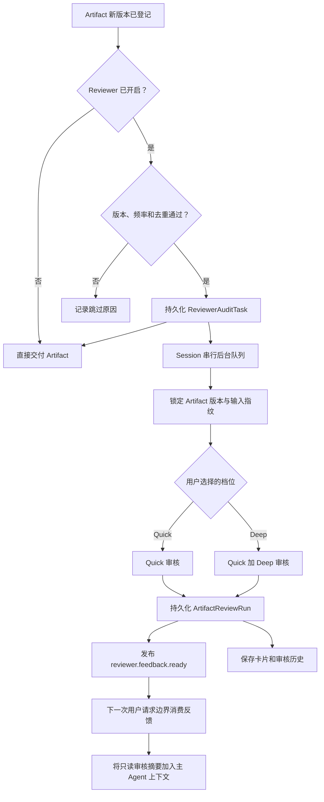

# Reviewer Specialist：自动证据审计与反馈闭环设计

> 状态：提案。目标是在不改变现有 Quick / Deep 审核语义的前提下，把审核变为用户可控、低频、异步的质量闭环。

## 1. 目标与边界

当前 Reviewer 已能对锁定的 Artifact 执行手动或 Agent 显式触发的 Quick / Deep 审核，但手动 HTTP 请求会等待执行完成，且 Artifact 新版本不会自动发起审核。本方案补齐以下闭环：

1. 用户启用 Reviewer Specialist 后，Artifact 新版本登记可自动创建低频审核任务；
2. 审核在后台执行，不阻塞 Artifact 交付、主 Agent 或用户继续对话；
3. 审核完成后保存结构化结果，并在下一次主 Agent 请求边界追加只读摘要；
4. 主 Agent 仅可将摘要作为证据参考，不会据此自动修改 Artifact 或触发外部副作用。

不在本方案中实现论文全文、表格、补充材料、原始数据或执行产物的读取；这些属于《全链路科研证据核验设计》。本方案只编排现有 Quick / Deep 能力。

## 2. 用户设置与触发规则

保留 Reviewer 开关和审核档位，不增加独立的反馈策略开关。审核结果统一作为只读证据交给下一次主 Agent 请求：

| Reviewer Specialist | Review level | 自动行为 |
|---|---|---|
| Off | 任意 | 不创建自动审核任务；不消耗模型或外部检索资源。 |
| On | Quick | 新 Artifact 稳定后低频执行本地格式、Evidence 和 Provenance 审核。 |
| On | Deep | 新 Artifact 稳定后低频执行 Quick，再执行受限的 Deep Citation / Computation 审核。 |

任务创建时必须写入 `reviewLevel` 快照；随后用户切换档位，不影响已排队或运行的任务。手动审核不受自动审核冷却时间限制，但仍复用相同的任务和结果模型。

自动任务必须满足以下节制规则：

- 仅审核当前 Session 中新登记的、当前仍为最新版本的 Artifact；
- 同一 Session 同时最多运行一个 Reviewer 任务；
- 连续版本在稳定窗口内合并，只保留最新版本；运行前已过期的任务标为 `superseded`；
- 同一 Artifact 内容哈希、审核档位、Evidence 指纹和策略版本一致时复用已有结果；
- Deep 受 Session 冷却时间和调用预算限制；Quick 也做去重，但不占用模型预算；
- JSON 等中间元数据仅执行适用的 Quick 结构/链路检查；叙述型报告才进入 Deep。

具体防抖、冷却和预算值由服务端策略配置，不写死在前端；首期需提供保守默认值并记录命中原因。

## 3. 异步审核与反馈流程



### 3.1 审核任务

新增轻量、持久化的 `ReviewerAuditTask`，不是通用任务平台。最小字段如下：

```text
id, sessionId, origin(manual|artifact_registered), reviewLevel,
artifactVersionIds, inputFingerprint, status,
createdAt, startedAt, finishedAt, supersededBy, errorSummary
```

状态为 `queued → running → completed | failed | cancelled | superseded`。`INCONCLUSIVE` 是审核结论，不是任务失败；基础设施不可用、取消和 Artifact 内容缺陷必须分别记录。

手动入口改为“创建任务并立即返回 `202 + taskId`”；现有 checkpoint 和 Reviewer 卡片继续作为对话中的可见锚点。服务重启时，未完成任务必须按明确策略恢复或标为中断，不能无声丢失。

### 3.2 主 Agent 只读反馈

`reviewer.feedback.ready` 仅携带结构化数据：Artifact 版本、结论、finding、严重度、证据引用、任务来源和策略版本。它绝不向正在生成中的单次模型调用强插上下文。

审核完成后保存 `ReviewFeedback`，并在用户下一次请求通过安全边界时，把数量受限的审核摘要追加到主 Agent 上下文。主 Agent 只能把它当作只读证据参考；该反馈不会自动修改 Artifact，也不会授权外部副作用。

## 4. 实现拆分

### PR1：手动审核异步化

- 创建、查询和取消 `ReviewerAuditTask`；
- 把手动 `Run review` 从同步等待改为后台执行；
- 保留现有 Quick / Deep 执行器、结果卡片和 checkpoint；
- 覆盖刷新恢复、取消、重复手动提交和失败展示。

### PR2：按用户档位低频自动审核

- 在 Artifact 新版本登记后进行 On/Off、Quick/Deep、版本、频率和指纹门控；
- 自动创建或合并任务，保证 Artifact 交付与主对话不等待审核；
- 覆盖 Quick 与 Deep 的自动任务、版本合并、去重、冷却和关闭开关。

### PR3：Lead Agent 安全反馈闭环

- 持久化并发布 `reviewer.feedback.ready`；
- 仅在下一次用户请求边界消费反馈；
- 实现一次性消费和上下文摘要大小限制；
- 覆盖运行中 Agent、已结束 Agent、失败/取消和用户手动继续对话。

## 5. 验收标准

- 开关 Off 时，Artifact 注册不会产生 Reviewer 任务；
- 开关 On 时，自动任务严格使用用户选择的 Quick 或 Deep；
- 自动审核不会阻塞 Artifact 注册、主 Agent 回复或用户发送下一条消息；
- 任何版本最多只有一个有效自动任务，旧版本不会在新版本之后继续审核；
- `INCONCLUSIVE`、超时和依赖降级不会被汇总为“Artifact 必须修订”；
- 主 Agent 只在安全边界读取只读反馈，审核结果不会自动修改 Artifact；
- 页面刷新、服务重启、任务取消和多 Session 并行均有集成测试覆盖。
